# Лабораторная работа №1. Введение в Linux.

**Что потребуется перед началом**:

- Компьютер, способный запустить систему виртуализации с виртуальной машиной GNU/Linux.
- Минимум 5 GiB свободного места на жестком диске (2.6 под систему, остальное под пакеты).
- [Желательно] Загруженный образ дистрибутива Debian.

**План и задачи лабораторной**:

1. Настройка виртуальной машины, основные команды, bash, пакеты, потоки
	- Установить ОС, проделать некоторый набор ручных операций, написать и запустить скрипт автоматизации
2. Пользователи и права доступа в Linux, лимиты, настройка sshd, генерация ключей, ssh-agent
	- Создать пользователя, выдать ему права, ограничить лимиты, настроить ssh-подключение по ключу

**Отчет** - в любом читаемом формате (pdf, md, doc, docx, pages).

Обязательное содержимое отчета:

0. Фамилия и инициалы студента, номер группы, номер варианта
1. План и задачи лабораторной
2. Часть 1 - кратко описать, что было сделано
3. Часть 2 - кратко описать, что было сделано 
4. Приложить очищенный вывод `history` выполненных команд
5. [Универсальный вывод по лабораторной работе][default-summary]


## Вступление

Для полного понимания рекомендуется ознакомиться с разделами "Терминология", "Файлы, каталоги, права" и "Работа с системой" [справочных материалов][wiki-page].


## Часть 1.

Задача: установить любую систему виртуализации, настроить виртуальную машину с любым дистрибутивом GNU/Linux и выполнить набор простейших действий (подробно описан в п. 1.2).

> Примечание: Если вы не работали с виртуализацией раньше - ставьте VirtualBox. Вопросы различий виртуализации и решения проблем с системами виртуализации выходят за рамки курса.

> Примечание: Если вы не работали раньше с GNU/Linux - ставьте дистрибутив Debian (он используется в методических указаниях). Вопросы различий дистрибутивов и проблем с установкой ПО на разных дистрибутивах выходят за рамки курса.

> Примечание: Если вы опытный "линуксоид" - стоит сразу начинать работать по ssh (сразу проделав все из части 2)


### 1.1. Подготовка рабочего окружения

0. Устанавливаем [VirtualBox][virtualbox-install] или любую другую систему виртуализации.

> Примечание: Речь идет об аппаратной или программной виртуализации. Т.е. "Просто накатить Docker" - не прокатит.
> А если вы все еще не понимаете, что контейнеризация это частный случай виртуализации на уровне операционной системы - вам стоит посмотреть доклад про DevOps и/или прочитать дополнительные материалы.

1. Скачиваем образ для установки дистрибутива Debian.
Это можно сделать с [зеркала МИФИ][debian-mirror]. Впрочем, вы можете выбрать любой способ загрузки, подходящий вам, например через [BitTorrent][debian-torrent]. Все варианты можно узнать [тут][debian-all-mirrors].

> Во время подготовки курса использовался [образ][debian-iso] `debian-11.2.0-amd64-DVD-1.iso`, как наиболее универсальный вариант. Но с серверов МИФИ он загружался целую вечность. **Лучше использовать BitTorrent**.

2. Пока качается образ - создаем виртуальную машину (далее ВМ) в системе виртуализации. Ставить будем в VirtualBox (далее VB).

   Как назвать - дело ваше. Удобно набрать "debian" в названии, тогда VB сразу подставит значения для Debian в выпадающие списки.
   

   Выделяем диск. Использовать рекомендуется динамический виртуальный диск. Тогда покуда внутри ВМ вы не забьете место на диске - оно не будет занято и в вашей хостовой системе. Фактический размер будет динамически растягиваться под требования (но автоматически сжиматься не будет). Достаточно будет и 10 GiB. Лучше сразу больше, все равно место оно не занимает, пока не потребуется.
   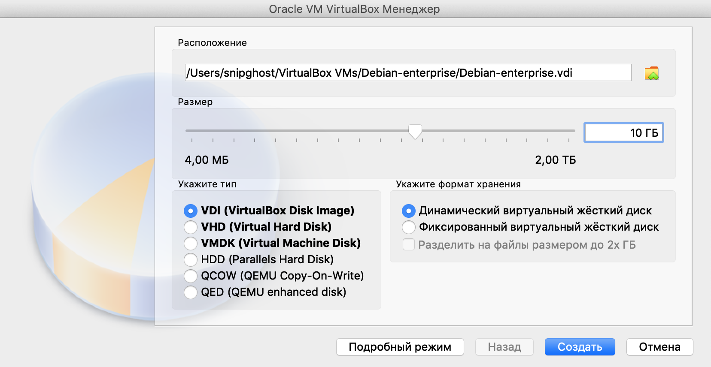

   Получится как-то так:
   

3. В настройках ВМ в системе виртуализации выбираем загруженный образ в качестве содержимого оптического носителя, чтобы с него загрузиться:
    

  > Примечание: Для систем с большим разрешением экрана советую сразу поставить в "Настройки ВМ" -> "Дисплей" коэффициент масштабирования побольше. На MacBook-ах с Retina-display иначе слишком мелко.

4. Запускаем виртуальную машину и устанавливаем систему. Подробно рассматривать процесс установки не будем, остановимся только на самых важных деталях. Для интересующихся руководство по установке Debian для x86-64 архитектуры вы можете найти [тут][debian-install].
   [Полный список руководств][debian-all-install].

   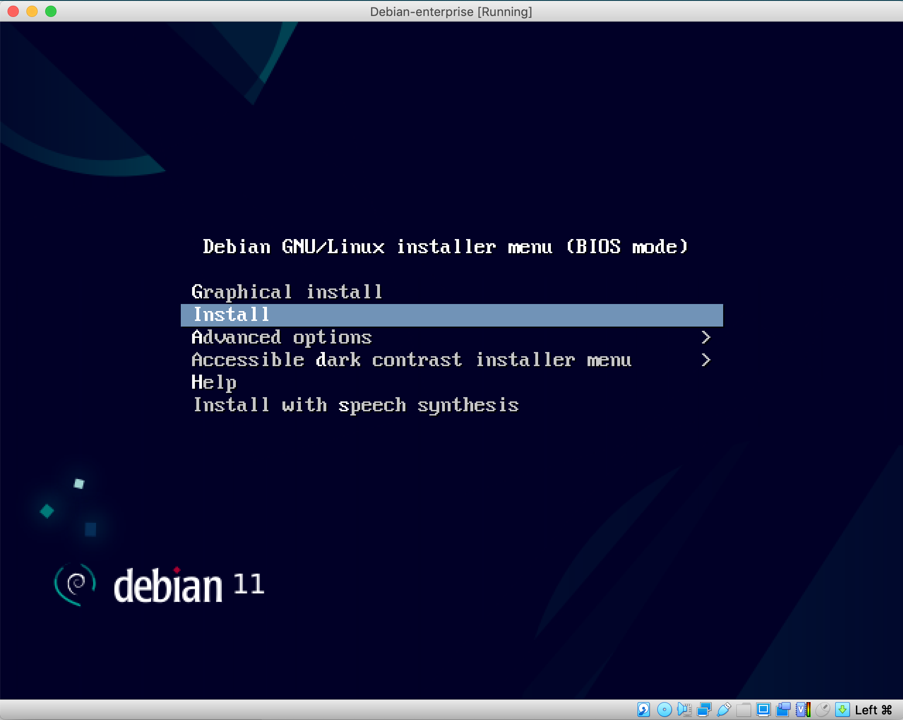

   Итак, к важным деталям, использовать будем текстовый установщик, чтобы не пришлось делать миллион снимков экрана в методичку. Разберем подробно, чего от нас хочет установщик:

   + Выбор региона и раскладки клавиатуры. Если выбираете себе что-то кроме английской раскладки - дело ваше, страдать Вам. Я оставляю все по-умолчанию.
   + Далее установщик попросит вас ввести `hostname` - [сетевое имя системы][hostname]. На ваше усмотрение. В нашем примере выберем `enterprise`.
   + Теперь `domain`, для ВМ можно использовать `vm`. Получится что-то вроде `enterprise.vm`.
   + Пароль [root][root]. Пользователя с идентификатором (UID - user ID) 0 и имеющим неограниченные привилегии. Аналог администратора. Далее будем называть его root. Настоятельно не советуем ставить свой настоящий сложный пароль на ВМ. После ввода его попросят еще раз для подтверждения, что вы в своем уме.
   + Имя вашего аккаунта и имя пользователя. Выбирайте что-то простое и ёмкое. В примере используется `mak` для всего.
   + Пароль аккаунта. Те же советы, что и для пароля root.
   + Разметка диска. Для общей однообразности выбираем `Guided - use entire disk and set up LVM`. Система автомагически поставится поверх LVM. Для реальных систем идут жаркие споры о том стоит или не стоит ставить систему на LVM. Но у нас требований к надежности нашей виртуальной машины нет, поэтому установим сразу поверх. Из плюсов решения: можно легко расширять доступное под систему место с помощью добавления новых дисков в lvm. Из минусов: при потере части этих дисков есть шанс систему больше не запустить.
   + Далее может отличаться в зависимости от того, что вы выбрали на прошлом шаге, будем считать, что нужное.
   + Какой диск пойдет под нож разметки диска и куда будет установлена система. Выбора нет, виртуальный диск в ВМ пока только один.
   + Необходимо ли разделить диск на несколько разделов для отдельных директорий. Выбираем `Separate /home, /var, and /tmp partitions`. Все по-взрослому. Часто эти директории вообще выносят на отдельные диски, что очень удобно, например: система и программы на ssd, а логи и ваши фотографии из отпуска, которые вы никогда больше не будете смотреть, на hdd.
   + Подтверждение, что ранее по разметке все выбрано верно. Выбираем `Yes`.
   + Сколько места вы хотите отвести под логический том LVM. Выбираем максимум или пишем `max`.
   + Подтверждение, что вы действительно хотите записать изменения на диск. Выбираем `Yes`. У нас получились вот такие разделы: 
   + Начнется установка системы. Это может занять значительное время, особенно если вы используете netinstall-образ и медленную сеть. Самое время сделать себе чаю.
   + Далее установщик предложит просканировать дополнительные источники для установки пакетов. Актуально, когда вы работаете в банке у вас нет доступа в интернет, но есть требования сразу установить определенное ПО, тогда его можно установить с других носителей. Игнорируем, выбираем `No`.
   + Далее установщик предложит выбрать источник репозиториев в системе - c текущего образа DVD (на нем есть некоторые пакеты) или из зеркала в сети. `Use network mirror?` выбираем `Yes`. Это более простой вариант поиска нужного ПО, а ограничений на доступ к интернету у нас нет.
   + Страна, для определения списка ближайших зеркал. Выбираем `Russia`, а далее понравившийся. Мы в примере все же будем использовать `deb.debian.org`, привычнее и надежнее для демонстрации.
   + HTTP-proxy для доступа к интернету. Иногда из корпоративного контура нет прямого доступа в интернет. Нам не актуально, будем ходить напрямую. Оставляем пустую строку, выбираем `Continue`.
   + Участие в программе сбора статистики - на ваше усмотрение.
   + Список предустанавливаемого ПО. Выбираем только ssh-сервер и стандартные системные утилиты. За использование "иксов" (визуального окружения рабочего стола, которые ранее назывались X Window System с реализацией в виде Xorg, но уже давно используются Wayland или Mir) получите минус в карму. Тыкаем "ввод", начнется установка ПО. Включаем у себя режим Хатико и вспоминаем про остывший чай.
   + Варианты установки GRUB. Что такое grub - поговорим отдельно. У нас на диске будет обнаружена только одна система на одном диске, так что установщик предложит установить его сразу на основной диск. Соглашаемся, `Yes`.
   + Выбираем этот диск (/dev/sda), он у нас один. 
   + Установка завершена! Успех. Установщик услужливо отправит команду на извлечение устройства с установщиком, чтобы вы при перезагрузке не попытались снова устанавливать систему. VB нормально обрабатывает такое поведение и удаляет образ из виртуального оптического привода (в настройках отображаться не будет больше). Начинается перезагрузка.
   + Пробуем войти своим пользователем. Если все введено верно, то вы увидите приглашение ввода команд (command prompt), например: `mak@enterprise:~$ `. ВМ "на логине". Критический успех!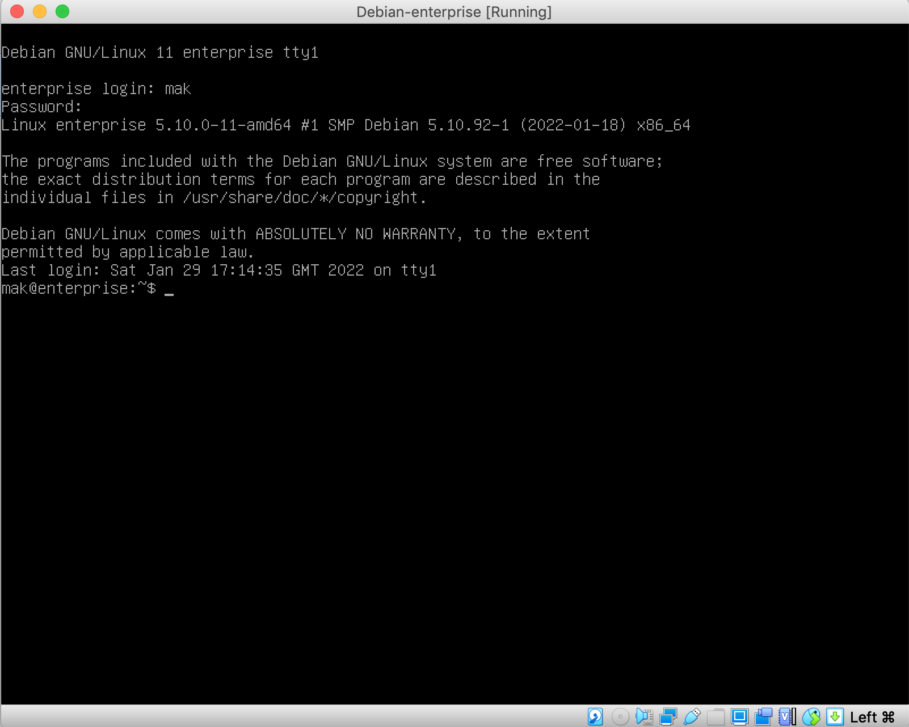

5. Делаем мгновенный снимок виртуальной машины, если ваша система виртуализации это поддерживает. Тогда в любой момент мы сможем вернуться на данное состояние системы, если что-то сломаем. В VB переходим во вкладку "Снимки" (Snapshots) и нажимаем "сделать". Названия не принципиальны.

   > Люди делятся на два типа:
   > 1) Еще не делают бэкапы
   > 2) Уже делают бэкапы

   

   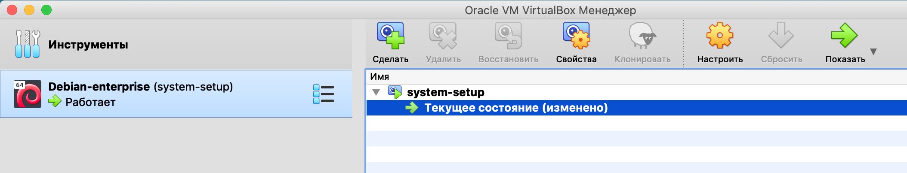

6. Что-нибудь изменим в системе, например напишем пару команд и выключим ВМ. Теперь попробуем восстановить мгновенный снимок из шага 5. Если все в полном порядке, вы откатитесь к состоянию ВМ на момент конца шага 4.

   > Люди, которые делают бэкапы, делятся на два типа:
   > 1) Еще не проверяют свои бэкапы после создания
   > 2) Уже проверяют свои бэкапы после создания

   

   Снимаем галочку, чтобы не создать снимок текущего (будем считать его испорченным) состояния:
   

   > Можете добавить в список навыков в выводе отчета, что вы научились делать резервные копии и сразу проверять их на работоспособность. **Очень важный навык для любого DevOps-инженера или администратора.**

7. Перезагружаемся (reset) с помощью VB. ВМ мгновенно перезапустится (будто мы обесточили и снова запустили сервер). Если все в порядке - вы снова окажетесь "на логине". 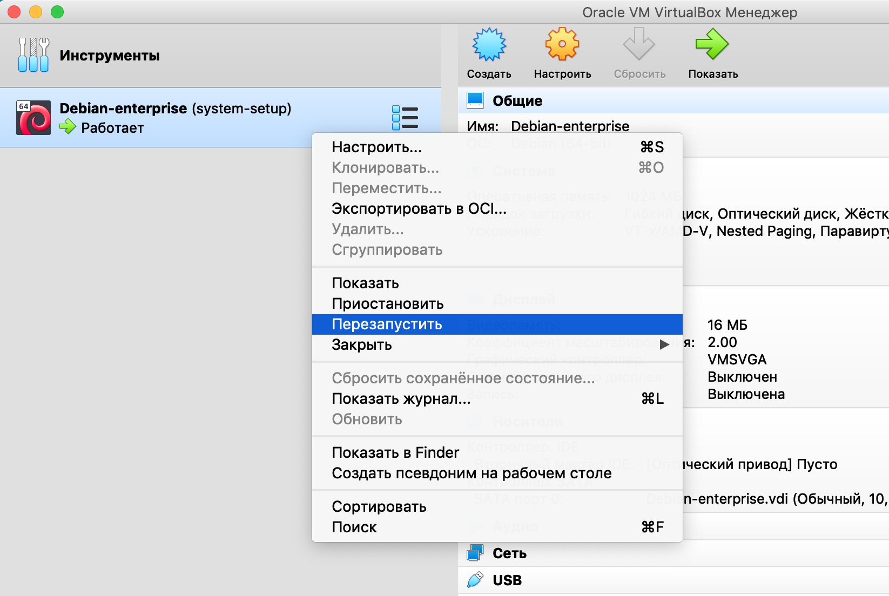

### 1.2. Выполнение базовых команд

Шпаргалка наиболее частых команд:

- cd (change directory) - сменить рабочий каталог
- mv (move) - переместить объект фс
- cp (copy) - скопировать объект фс
- mkdir (make directory) - создать каталог
- echo - вывод аргументов на экран
- cat - вывод объекта (например, файла) на экран
- less - утилита для удобного просмотра больших текстовых файлов
- sort - утилита для сортировки
- grep - фильтрация строк по подстрокам

> Статья о циклах в командной оболочке [тут][bash-loop]

Для выполнения работы вам непременно потребуется знание о том, что такое конвейер (pipeline). Небольшое напоминание о работе конвейера:

`cat file.txt | grep bmstu | sort -u`
`cat file.txt` - вывести содержимое файла, передаем это утилите grep
`grep bmstu` - оставить только строки, содержащие bmstu, передать вывод утилите `sort`
`sort -u` - отсортировать в алфавитном порядке и оставить только уникальные значения


1. Выполнить набор ручных операций в терминале

   >  Примечание: если написано "с содержимым `xyz\n`", то в файл нужно записать `xyz` и перевод строки. Однако, утилита echo по-умолчанию добавляет в конец записи перевод строки, не требуется специально это прописывать.

   + Перейти в домашнюю директорию вашего пользователя `~`
   + Вывести содержимое директории, включая скрытые файлы
   + Создать в текщей директории новую директорию `test`
   + Перейти в директорию `test/`
   + Вывести полный путь до текущей директории
   + Вернуться в домашнюю директорию
   + Создать пустой файл `~/test/file1.txt`
   + Создать файл `~/test/file2.txt` с содержимым `Hello\n`
   + Создать файл `~/test/file3.txt` с содержимым `World\n`
   + Дописать в файл `~/test/file3.txt` строку `Hello3\n`
   + Создать файлы `~/test/file${N}.txt` с содержимым `Hello${N}\n`, где `${N}` заменить на число, пробегающее [4; 6]
+ Создать файлы `~/test/file${N}.txt` с содержимым `World${N}\n`, где `${N}` заменить на число, пробегающее [7; 39]
   
   + Прейти в директорию `test/`, используя поиск по последним командам bash (CTRL+R)
+ Вывести содержимое файла `file31.txt`
   + Вывести только последнюю строку файла `file3.txt`
   + Вывести список всех файлов в текущей директории, содержащих подстроку `Hello` (и не забыть more/less)
   + Вывести список всех файлов в текущей директории, отсортированный по числовому возрастанию номера после `file` в названии (и не забыть more/less)
   
   > Интерактив: как вернуться обратно в домашнюю директорию максимально возможным числом способов?
   > Интерактив: поразмыслить о том, какие могут быть варианты создать пустой файл?

2. Станьте суперпользователем (root-ом) с помощью утилиты `su`.

   > **Root** (англ. *root* — корень; читается «рут»), или **суперпо́льзователь** — это специальный аккаунт и группа пользователей в UNIX-подобных системах с идентификатором UID 0 (User IDentifier), владелец которого  имеет право на выполнение всех без исключения операций. Суперпользователь UNIX-систем имеет логин «root» только по умолчанию и легко переименовывается при необходимости, часто встречается переименование в «toor» для усложнения подбора паролей автоматическими сканерми.
   >
   > **su** (англ. **S**ubstitute **U**ser, **S**et **U**ID, **S**witch **U**ser*, **S**uper **U**ser* — замена пользователя, переключение пользователя, суперпользователь) — команда Unix-подобных операционных систем, позволяющая пользователю войти в систему под другим именем, не завершая текущий сеанс. Обычно используется для временного входа суперпользователем для выполнения административных работ. По умолчанию предполагается работа от имени пользователя root. Если первый аргумент `su` — дефис `-`, среда будет установлена такой же, как при регистрации заданного пользователя. Иначе передается текущая  среда, за исключением значения $PATH, которое задается переменными PATH и SUPATH в файле `/etc/default/su`.

   ```bash
   su -
   # вводим пароль root, становимся root-ом (видно по строке приглашения)
   ```

3. Отредактируйте список репозиториев `/etc/apt/sources.list` с помощью любого текстового редактора.

   > Примечание: Если вы не работали ранее с vi/vim - используйте nano. Вопросы "как выйти из vim" выходят за рамки курса.

   Пример того, как открыть файл на редактирование в nano:

   ```bash
   nano /etc/apt/sources.list
   ```

   Нужно удалить или закомментировать строку `deb cdrom:[Debian GN...`. Это остатки от нашей установки с DVD-носителя, мы его извлекли уже и устанавливать оттуда ничего не собираемся.

   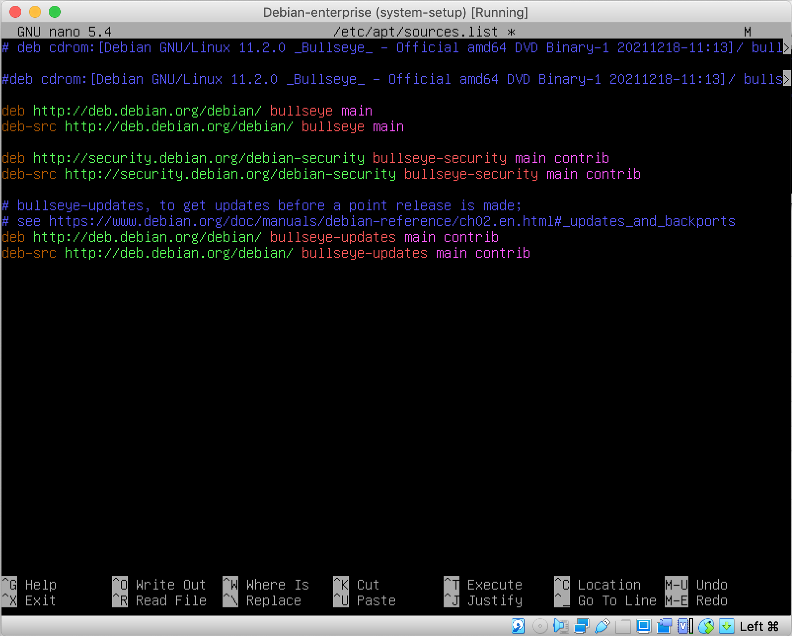

4. Определить, есть ли у вас в системе утилита `sudo`:

   - Выполняются только исполняемые файлы, которые обнаружены в переменной PATH или передан полный путь до файла. Поиск по PATH происходит последовательно, слева направо. Как правило, PATH задается в .bashrc.

   - `which sudo` - покажет путь до исполняемого файла программы, если она найдена в PATH.

     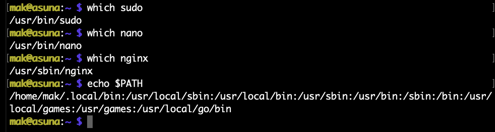

   - Установить пакет `sudo` с помощью пакетного менеджера `apt` если его нет. [Руководство][man-apt].
     Пример:

   ```bash
   apt install -y sudo
   ```

5. Перестаньте быть root - наберите команду `exit` или нажмите комбинацию `^D` (CTRL+D)

6. Напишите "исполняемый" bash-скрипт (лучше sh), который создает в текущей директории файлы `test/file${N}.txt` с содержимым `Hello${N}\n`, где `${N}` заменить на число, пробегающее [X; Y], если они еще не созданы. X и Y задаются как 1 и 2 аргументы соответсвенно.

   > Примечание: в GNU/Linux CTRL часто обозначается как ^
   >
   > Сохранить в nano: `^O`  
   > Выйти из nano: `^X`  

   Пример скрипта, который создает файл с содержимым первого и второго аргументов:

   ```bash
   #!/bin/sh
   
   echo "$1" > test.txt
   echo "$2" >> test.txt
   ```

   Пример того, как сделать файл "исполняемым":
   ```bash
   chmod +x file.sh
   ```

   Пример того, как запустить “исполняемый” файл c аргументами из текущей директории:
   ```bash
   ./file.sh 10 15
   ```

   > Интересный факт: а почему исполняемый файл нельзя запустить просто написав file.sh как в windows? 
   >
   > Все дело в безопасности. Это очень плохая идея позволять подменять стандартные утилиты файлами из текущей директории, есть риск исполнить не то, что подразумевал пользователь, а то, что подложил ему в каталог злоумышленник. Поэтому текущая директория **не добавляется** к переменной PATH, списку директорий в которых производится поиск исполняемых файлов.

7. Продемонстрировать умение пользоваться утилитой [man][https://ru.wikipedia.org/wiki/Man]. Вывести страницу мануала для утилиты apt.

8. Демонстрация проделанной работы происходит через вывод утилиты `history` и вывод содержимого скрипта из п.4.


## Часть 2.

Задача: создать пользователя, выдать ему права и доступ к sudo, настроить подключение по ssh.

### 2.1. Пользователи и права

> Примечание: в этом пункте потребуется доступ суперпользователя (root), опустим процесс, вы уже научились это делать в первой части лабораторной работы.

1. Создать пользователя `ansible` с домашней директорией `/home/ansible/`. Например, с помощью утилиты `adduser`. Хорошая [статья][useradd-vs-adduser] о создании пользователей.

   > Важный момент: в GNU/Linux нет магии, все происходит максимально логично. Так, добавление пользователя сводится к изменению файлов `/etc/passwd` и `/etc/shadow`. Исторически файл `/etc/passwd` содержал информацию о пользователях и их зашифрованные (чаще всего - хешированные) пароли. Однако, для того, чтобы пользователь мог взаимодействовать с системой - запускать программы от лица других пользователей, просматривать права доступа и так далее, нам необходимо, чтобы этот файл был доступен для чтения всем. А значит, в теории, пароли других пользователей можно было бы подобрать перебором, ведь они нам были бы тоже доступны. Для того, чтобы избежать проблем с утечкой паролей - их вынесли в отдельный файл `/etc/shadow`. Больше о формате этих файлов стоит узнать в справочных материалах.

   

2. Поменять пользователю `ansible` пароль с помощью `passwd`.

3. Создать группу `admin` с помощью `groupadd`.

4. Создать директорию `/admin` c помощью `mkdir`.

5. Сделать owner-ом директории `/admin` пользователя `ansible` и выдать права группе `admin`.

6. Выдать на права на чтение и редактирование пользовтелю `ansible`, а группе `admin` только не чтение.

   ```bash
   chmod 755 /admin
   ```

7. > **sudo** (англ. **S**ubstitute **U**ser and **do**, дословно «подменить пользователя и выполнить») — программа для системного администрирования UNIX-систем, позволяющая делегировать те или иные привилегированные ресурсы  пользователям с ведением протокола работы. Основная идея — дать пользователям как можно меньше прав, но при этом достаточных для решения поставленных задач.

   С помощью утилиты `visudo` можно отредактировать файл `/etc/sudoers` (через утилиту - чтобы ничего не сломать, она создает временный файл и перед применением изменений проверяет синтаксис)  - разрешить группе `wheel` делать `sudo` с паролем.

   Этого можно добиться добавив строку `%wheel ALL=(ALL:ALL) ALL`

   - **%wheel** ALL=(ALL:ALL) ALL
     Первое поле показывает имя пользователя или группы, к которым будет применяться правило, в данном случае к группе **wheel**, для пользователя нужно убрать `%`.
   - %wheel **ALL=**(ALL:ALL) ALL
     Первое “ALL” означает, что данное правило применяется ко всем хостам.
   - %wheel ALL=(**ALL**:ALL) ALL
     Данное “ALL” означает, что пользователь группы **wheel** может запускать команды от лица всех пользователей.
   - %wheel ALL=(ALL:**ALL**) ALL
     Данное “ALL” означает, что пользователь группы **wheel** может запускать команды от лица всех групп.
   - %wheel ALL=(ALL:ALL) **ALL**
     Последнее “ALL” означает, что данные правила применяются всем командам.

   Хорошая статья о sudoers файле [тут][sudoers].

8. Добавить пользователя `ansible` в группу `wheel` с помощью утилиты `usermod` - теперь он сможет выполнять команды от лица суперпользователя через `sudo` с использованием своего пароля.

Пример частичного выполнения данного задания:


### 2.2. Подключение по SSH

**SSH** (англ. **S**ecure **Sh**ell — «безопасная оболочка») — сетевой протокол прикладного уровня, позволяющий производить удалённое управление операционной системой и [туннелирование](https://ru.wikipedia.org/wiki/Туннелирование_(компьютерные_сети)) TCP-соединений (например, для передачи файлов). Схож по функциональности с более старыми протоколами Telnet и rlogin, но, в отличие от них, шифрует весь трафик, включая и передаваемые пароли. SSH допускает выбор различных алгоритмов шифрования.

**По-умолчанию ssh-сервер использует 22-ой TCP-порт.**

0. Установить на **основную систему** (ее еще называют хостовой или гипервизором) ssh-клиент. В Unix/Linux системах `ssh` стоит по-умолчанию. В Windows - [PuTTY][putty], проще всего скачать установщик всех утилит (сам PuTTY, PuTTYgen, pageant и прочие программы).

1. Настроить "проброс портов" для виртуальной машины **127.0.0.1:2222 -> 10.0.2.15:22**

   

   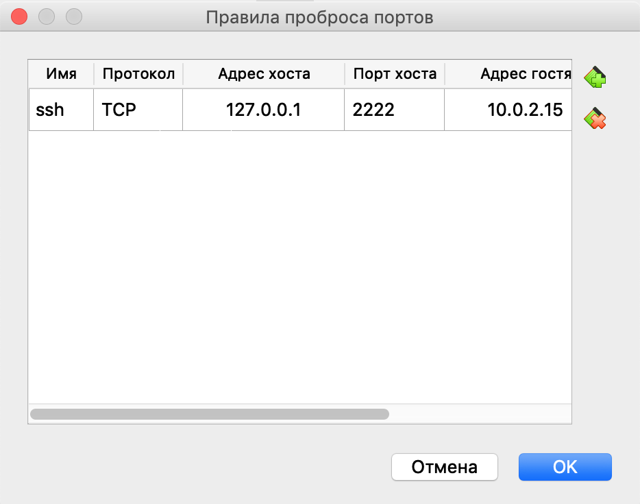

2. На **ВМ** - установить и запустить sshd (проверить запущен ли: `systemctl status sshd`, запустить: `systemctl start sshd`)

3. На **основной** системе настроить ssh-подключение по ключу

   > Примечание: подробная статья о PuTTY есть на [хабре][putty-habr].

   + Сгенерировать ssh-ключи (в утилите [PuTTYgen][puttygen] или `ssh-keygen`). Для этого нужно перегенерировать ключ 2 версии.

     Windows:

     

     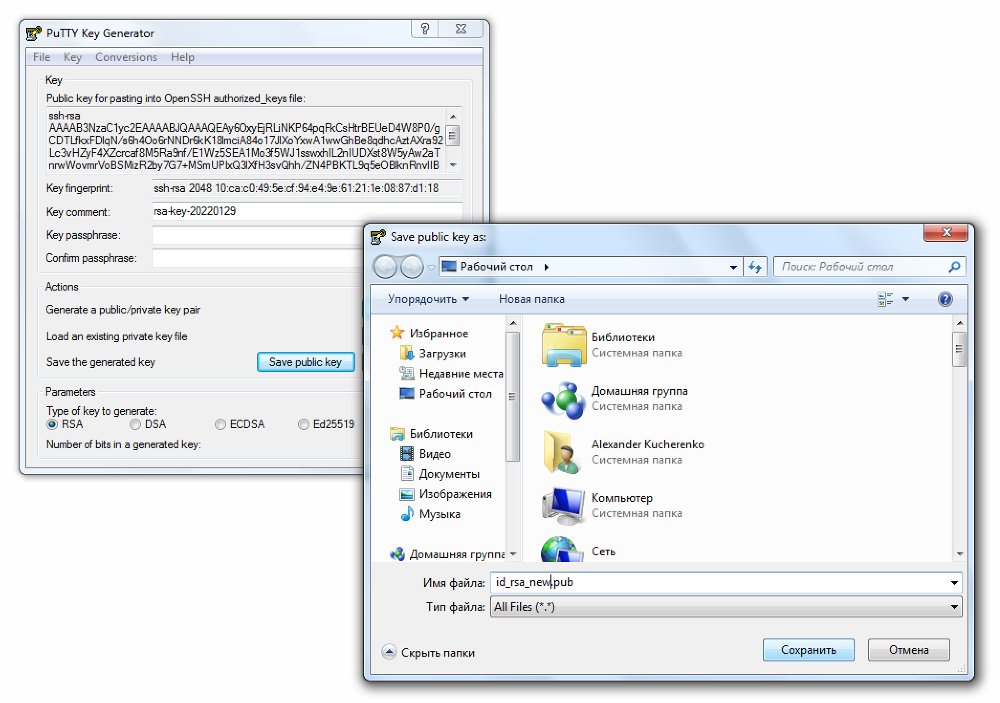

     Unix/Linux:

     

   + Положить публичную часть ключа в файл `/home/ansible/.ssh/authorized_keys` на **ВМ**

   + Проверить права файла `/home/ansible/.ssh/authorized_keys`, они должны быть `rw-r--r--`

4. Продемонстрировать подключение по ssh (PuTTY+pageant для windows) под пользователем `ansible` и стать root-ом с помощью sudo.

   Windows:

   

   

   

   Unix/Linux, сразу с применением `ssh-copy-id` вместо ручного редактирования `authorized_keys`:

   

   

5. Показать soft-лимиты (`ulimit`) и hard-лимиты, пояснить как поняли, в чем разница, как изменить?

   Хорошая [статья][linux-limits] о лимитах.

   > Примечание: это может оказаться жизненно важным знанием в случае появления высоких нагрузок на вашем сервере. Ошибка "Too Many Open Files" может появляться как раз из-за ограничений в лимитах, по-умолчанию они довольно небольшие (1024 для open files).

   Пример вывода `ulimit` для пары систем (ВМ и реальный Raspberry-Pi сервер):

   

   Посмотрим лимиты для конкретного процесса, тоже бывает полезно:

   ```bash
   # Некоторые программы кладут свой Process ID (PID) в /var/run
   cat /var/run/sshd.pid # Выведет PID sshd
   
   # Выведем лимиты процесса sshd с помощью procfs
   cat /proc/$(cat /var/run/sshd.pid)/limits
   # P.S. Про procfs подробно поговорим во второй лабораторной работе
   ```

   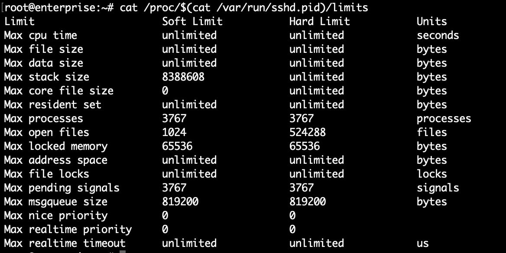

   Занятное наблюдение работы лимитов:

   

   

6. Перестать быть root-ом уже!

7. Показать что в ssh-agent есть ваш ключ (`ssh-add -L`), если нет, то проверить настройки ssh-клиента (`ForwardAgent yes`).

   > `ssh-agent` — это менеджер ключей для SSH. Он хранит ваши ключи и сертификаты в памяти, незашифрованные и готовые к использованию `ssh`. Это избавляет вас от необходимости вводить пароль каждый раз, когда вы  подключаетесь к серверу. Он работает в фоновом режиме в вашей системе,  отдельно от `ssh`, и обычно запускается при первом запуске `ssh`-подключения. Опиция ForwardAgent позволяет пробрасывать ваши ключи от одного сервера к другому через цепочку ssh-агентов. Таким образом вам не придется копировать свой ключ последовательно на все узлы в цепочке подключений, что значительно повышает безопасность.

   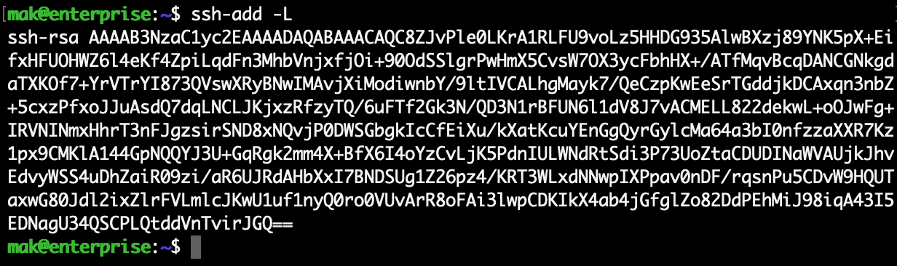

   

8. **Дополнительное задание**: настроить `/root/.bashrc` файл, применяющийся при создании новой оболочки для root пользователя.

   Хорошая [статья][bash-profile-rc] о bash_profile и bashrc.

   [Пример][bashrc-example] большого и сложного .bashrc файла.

   PS1 - переменная для изменения вида приглашения, например такое значение красит в красный:

   ```bash
   PS1='\[\e]0;\u@\h: \w\a\]${debian_chroot:+($debian_chroot)}\[\033[01;31m\]\u@\h\[\033[00m\]:\[\033[01;34m\]\w \$\[\033[00m\] '
   ```

   Синонимы (alias-ы) для подкрашивания вывода команд:

   ```bash
   # enable color support of ls and also add handy aliases
   if [ -x /usr/bin/dircolors ]; then
       test -r ~/.dircolors && eval "$(dircolors -b ~/.dircolors)" || eval "$(dircolors -b)"
       alias ls='ls --color=auto'
       alias dir='dir --color=auto'
       alias vdir='vdir --color=auto'
   
       alias grep='grep --color=auto'
       alias fgrep='fgrep --color=auto'
       alias egrep='egrep --color=auto'
   fi
   ```

   Просто удобные общепринятые сокращения:

   ```bash
   # some more ls aliases
   alias ll='ls -l'
   alias la='ls -A'
   alias l='ls -lA'
   ```

   Переопределения стандартных команд с ключами, чтобы спрашивали подтверждение:

   ```bash
   # Some more alias to avoid making mistakes:
   alias rm='rm -i'
   alias cp='cp -i'
   alias mv='mv -i'
   ```

   

   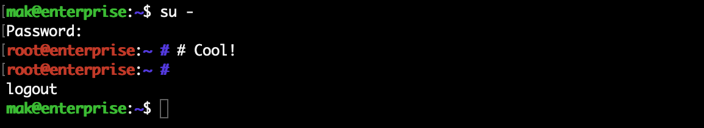

   

9. Создайте еще один мгновенный снимок ВМ, как в пункте 5 раздела 1.1.
   *Чтобы не случалось “упс, у меня все работало, а вот сейчас перестало”.*

   

**Далее в лабораторных рекомендуется использовть способ работы с системой по ssh и запускать ВМ в фоновом режиме (без интерфейса вообще)**


## Контрольные вопросы

1. Что такое Linux?
2. Что делает каждая из команд, применяемых в лабораторной работе?
3. В чем разница между su и sudo?
4. Что происходит в подробностях, когда вы вводите `cat file.txt`?
5. Что такое файловый дескриптор? Какие создаются по умолчанию?
6. Как дописать в файл вывод команды? Как перезаписать файл? Как избавиться от вывода ошибок?
7. Как определяются права на файл?
8. Как создать пользователя в GNU/Linux?
9. Как пользоваться man?
10. Как сделать файл исполняемым?
11. Как выдать права на sudo?
12. Зачем .bashrc файл?
13. Как подключиться к сервиру по ssh? Подробно о всех возможных проблемах.
14. Что такое публичный и приватный ключ? Какой оставляем себе, а какой копируем на сервер?
15. ssh-agent - зачем?
16. В чем разница между soft и hard лимитами?
17. Кто такой суперпользователь и что ему можно?
18. Нужно ли делать резернвые копии? А что еще нужно делать?


[habr-debian]: https://habr.com/ru/news/t/572976/
[debian-all-mirrors]: https://www.debian.org/CD/http-ftp/#mirrors
[debian-mirror]: http://mirror.mephi.ru/debian-cd/current/
[debian-torrent]: https://www.debian.org/CD/torrent-cd/
[debian-iso]: http://mirror.mephi.ru/debian-cd/current/amd64/iso-dvd/debian-11.2.0-amd64-DVD-1.iso
[debian-install]: https://www.debian.org/releases/stable/amd64/index.ru.html
[debian-all-install]: https://www.debian.org/releases/stable/installmanual
[virtualbox-install]: https://www.virtualbox.org/wiki/Downloads
[hostname]: https://en.wikipedia.org/wiki/Hostname
[root]: https://ru.wikipedia.org/wiki/Root
[default-summary]: ./Summary.md
[man-apt]: https://www.opennet.ru/man.shtml?topic=apt-get&category=8&russian=0
[putty]: https://www.putty.org/
[puttygen]: https://www.ssh.com/academy/ssh/putty/windows/puttygen
[putty-habr]: https://habr.com/ru/post/127521/
[linux-limits]: https://andreyex.ru/linux/komandy-linux-i-komandy-shell/upravlenie-resursami-sistemy-s-pomoshhyu-komandy-ulimit/
[useradd-vs-adduser]: https://andreyex.ru/linux/komandy-linux-i-komandy-shell/useradd-protiv-adduser-v-chem-raznitsa/
[bash-profile-rc]: https://devacademy.ru/article/razbiraiemsia-s-failami-etc-profile-i-etc-bashrc
[bashrc-example]: https://www.opennet.ru/docs/RUS/bash_scripting_guide/a15124.html
[sudoers]: https://www.digitalocean.com/community/tutorials/how-to-edit-the-sudoers-file-ru
[linux-core]: https://ru.wikipedia.org/wiki/Ядро_Linux
[linux-os]: https://ru.wikipedia.org/wiki/Linux
[unix-way]: https://ru.wikipedia.org/wiki/Философия_Unix
[streams]: https://ru.wikipedia.org/wiki/Стандартные_потоки
[descriptor]: https://ru.wikipedia.org/wiki/Дескриптор
[fd]: https://ru.wikipedia.org/wiki/Файловый_дескриптор
[file]: http://linux.yaroslavl.ru/docs/setup/mandrake/cl/ch09s02.html
[dir-term]: https://ru.wikipedia.org/wiki/Каталог_(файловая_система)
[syscall]: https://ru.wikipedia.org/wiki/Системный_вызов
[options]: http://www.linuxcookbook.ru/books/textbooks/linux_intro/ch03s04.html
[libc]: https://en.wikipedia.org/wiki/C_standard_library
[hard-io]: https://www.opennet.ru/docs/RUS/zlp/005.html
[golang-args]: https://gobyexample.com/command-line-flags
[python-args]: https://docs.python.org/3/library/argparse.html
[chattr]: https://ru.wikipedia.org/wiki/Chattr
[selinux]: https://wiki.gentoo.org/wiki/SELinux/Tutorials/How_SELinux_controls_file_and_directory_accesses
[command-prompt]: https://pingvinus.ru/note/bash-promt
[process-managment]: http://www.opennet.ru/docs/RUS/lnx_process/process2.html
[processes]: http://www.opennet.ru/docs/RUS/lnx_process/
[distro]: https://ru.wikipedia.org/wiki/Дистрибутив_Linux
[fhs]: https://refspecs.linuxfoundation.org/FHS_3.0/fhs/index.html
[process-article]: https://ru.wikipedia.org/wiki/Процесс_(информатика)
[thread-article]: http://citforum.ru/programming/unix/threads/
[thread-wiki]: https://ru.wikipedia.org/wiki/Поток_выполнения

[bash-loop]: https://losst.ru/tsikly-bash

[wiki-page]: ./Wiki.md

