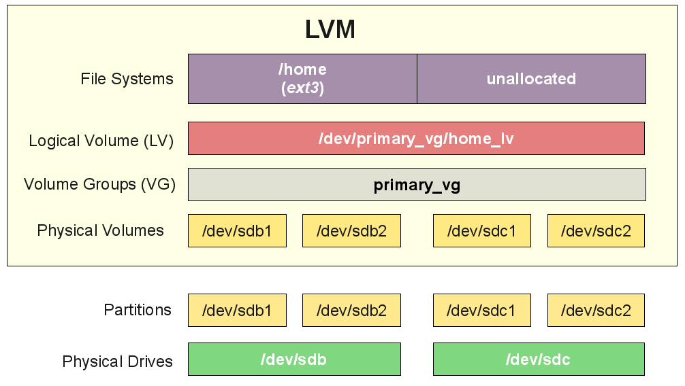

# Лабораторная работа №2. Процессы и VFS.

**Что потребуется перед началом**:

- Виртуальная машина с установленной GNU/Linux.

**План и задачи лабораторной**:

1. Процессы в Linux, мониторинг и управление системой, systemd, initrd, top/atop, dmesg, логи
   - Создать простейший systemd-unit, запустить набор сервисов, показать список процессов и чем они занимаются.
2. Файловая подсистема в Linux - VFS, inode, ссылки, ext4, mount, LVM
   - Подключить диск, создать фс, примонтировать, жесткие и мягкие ссылки, создать LV и растянуть его.

**Отчет** - в любом читаемом формате (pdf, md, doc, docx, pages).

Обязательное содержимое отчета:

0. Фамилия и инициалы студента, номер группы, номер варианта
1. План и задачи лабораторной
2. Часть 1 - кратко описать, что было сделано
3. Часть 2 - кратко описать, что было сделано 
4. Приложить очищенный вывод `history` выполненных команд
5. [Универсальный вывод по лабораторной работе]


## Вступление

Для полного понимания рекомендуется ознакомиться с разделами "Терминология", "Процессы" и “Файловая подсистема” [справочных материалов][wiki-page].


## Часть 1:

На практике сервера уже почти не управляются вручную. Создали подход IaaC. Ansible.

1. Установить `git`, `ansible` и развернуть сервисы с systemd-unit-ами.

   ```bash
   git clone https://github.com/SnipGhost/linux-course
   cd linux-course/ansible
   less README.md
   
   # Отредактировать шифрованный файл с секретами
   # vault-password: Zelda
   ansible-vault edit group_vars/all/secret.yml
   
   # Запустить раскатку
   ansible-playbook deploy-stage.yml
   ```

   > Может пригодится: зашифровать обычный файл можно так: `ansible-vault encrypt filename`

2. Проверить состояние сервиса `chronyd`, остановить его, снова проверить состояние, запустить:

   ```bash
   systemctl status chronyd
   systemctl stop chronyd
   systemctl status chronyd
   systemctl start chronyd
   ```

   > Это интересно: в терминах systemd кроме сервисов существуют еще “цели” - target. Они позволяют управлять несколькими процессами группой, одновременно.
   >
   > Кстати, а chronyd это программа-демон для синхронизации времени. Работает по протоколу NTP и является более продвинутой реализацией ntpd.

3. Открыть systemd-unit-файл `chronyd` и пояснить его содержимое. Сравнить его с файлом сервиса `node_exporter`. Отредактировать содержимое файла сервиса `node_exporter` (например удалить часть аргументов запуска в секции ExecStart). Попробовать перезапустить. Убедиться, что systemd ругается на неподгруженные изменения списка сервисов. Запустить `systemctl daemon-reload` а потом перезапустить сервис вновь.

4. Показать список процессов (в `top`, `atop` **или** с помощью` /proc`), отсортировать его по потреблению процессора, затем памяти, затем swap. Объяснить что такое [LA](https://ru.wikipedia.org/wiki/Load_Average) ([совсем подробная статья](https://habr.com/ru/company/vk/blog/335326/)).

5. Показать исторические данные `atop` с помощью ключа `-r` за прошедшие время из каталога: `/var/log/atop/`. ([статья про atop](https://fornex.com/ru/help/atop/))

6. Показать последние 10 сообщений в кольцевом буфере ядра с помощью `dmesg -T`. Статья [тут](http://rus-linux.net/MyLDP/consol/Linux_dmesg_Command.html).

7. Показать сообщения от момента последнего старта системы из файла `/var/log/messages`.

8. Пояснить, что такое [procfs](https://ru.bmstu.wiki/Procfs_(Proc_File_System)) и какую информацию можно получить из `/proc`.

9. Показать, сколько работает система без перезагрузки (`uptime`). Как узнать с большей точностью? Подсказка: с помощью procfs.

10. Показать загрузку дисков с детализацией за 5 секунд с помощью `iostat` ([статья про iostat](https://rtfm.co.ua/linux-opisanie-utility-iostat/)).

11. Показать сколько свободно оперативной памяти с помощью `free`. ([статья про free](https://andreyex.ru/operacionnaya-sistema-linux/komanda-free-v-linux-s-primerami/))

12. Запустить утилиту `top` в интерактивном режиме. Поставить на паузу отправив сигнал SIGSTOP с помощью `^Z`. Запустить просмотр файла `less /etc/passwd`. Также поставить на паузу. Просмотреть список задач с помощью `jobs -l`. Заставить выполняться `top` в фоновом режиме с помощью `bg`. Спойлер: он остановится, потому что есть защита от дурака. Запустить на первом плане просмотр файла с помощью `fg`.Поставить на паузу. Послать обеим процессам сигнал обрабатываемого завершения работы (SIGTERM, 15) с помощью kill. Объяснить в чем разница между SIGTERM (15) и SIGKILL (9). Статьи о [jobs, fg, bg](https://rtfm.co.ua/linux-upravlenie-fonovymi-processami/) и [более подробная](http://www.opennet.ru/docs/RUS/lnx_process/process2.html).


## Часть 2:

**VFS** - подсистема ядра Linux. Задает универсальный интерфейс для файловой системы.

1. Показать сколько свободно места в системе с помощью `df`.

2. Пояснить, что такое inode, какая там хранится информация и какие могут быть связаны с ними проблемы. Показать сколько свободно inode с помощью `df`.

3. Подключить еще один виртуальный диск размером X.

4. Разбить вновый виртуальный диск на три раздела с помощью `fdisk`, разметить на первом ФС (`mkfs.ext4`), примонтировать (`mount`), точка монтирования: `/mnt/vdisk1/`. Показать вывод списка блочных устройств `lsblk`. Создать директорию `/mnt/vdisk1/vdir1` и записать туда файлик `test` с любым содержимым (но не пустой).

5. Примонтировать директорию `/mnt/vdisk1/vdir1` в домашний каталог `/root/vdir1` так, чтобы содердижимое первого отображалось во втором и наоборот: `mount --bind /mnt/vdisk1/vdir1 /root/vdir1` . [Статья](https://access.redhat.com/documentation/ru-ru/red_hat_enterprise_linux/6/html/global_file_system_2/s1-manage-pathnames).

6. Доказать, что файл `/mnt/vdisk1/vdir1/test` и `/root/vdir1/test` - один файл (`diff`, `ls -li`). 

7. Реализовать автомонтирование первого раздела диска при старте системы (`/etc/fstab`).

8. Теперь LVM ([про LVM](https://koobik.net/%D1%83%D0%BF%D1%80%D0%B0%D0%B2%D0%BB%D0%B5%D0%BD%D0%B8%D0%B5-linux-lvm/)). Создать на 2 разделе physical volume (PV - `pvcreate`), volume group (VG - `vgcreate`) и logical volume (LV - `lvcreate`). Разметить поверх LV файловую систему ext4. Примонтировать, записать любой файлик. Затем создать на 3 разделе еще один PV, добавить его в VG (`vgextend`) и растянуть LV (`lvextend`). Не забыть растянуть ФС: `resize2fs`.

   

9. Создать “жесткие” и “мягкие” ссылки, объяснить разницу.


## Контрольные вопросы

1. Как загружается Linux?
2. Что такое PID, PPID?
3. Состояния процессов?
4. Что делает каждая из команд, применяемых в лабораторной работе?
5. Что такое Ansible?
6. Что такое `systemd` и systemd-unit?
7. Объясните метрики load average и uptime?
8. Утилита `top` - что показывают: us, sy, ni, id, wa, hi, si, st?
9. Как пользоваться `jobs`, `fg`, `bg`, `nohup`?
10. Что такое VFS?
11. Что такое inode, какую информацию хранит?
12. Каков процесс монтирования?
13. Автомонтирование, `/etc/fstab`?
14. Что такое LVM и зачем?
15. “Жесткие” и “мягкие” ссылки - в чем разница?

