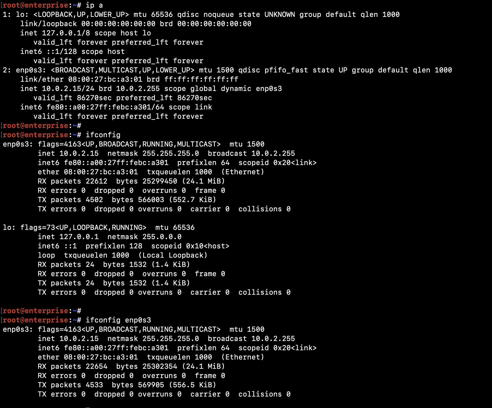
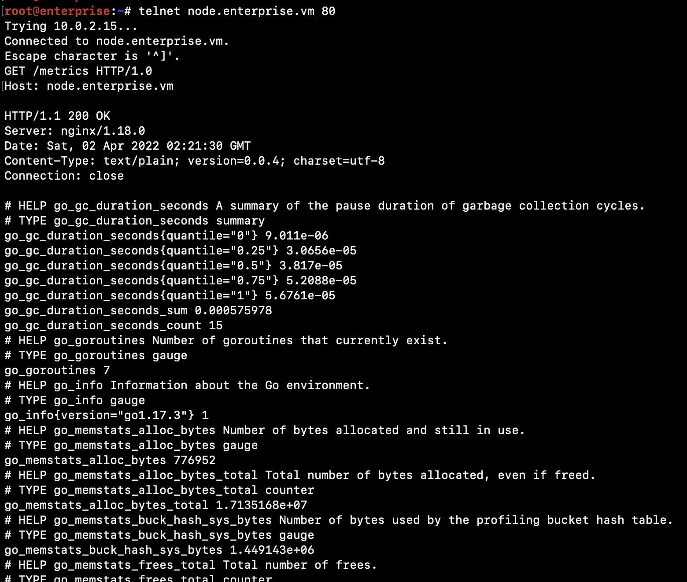
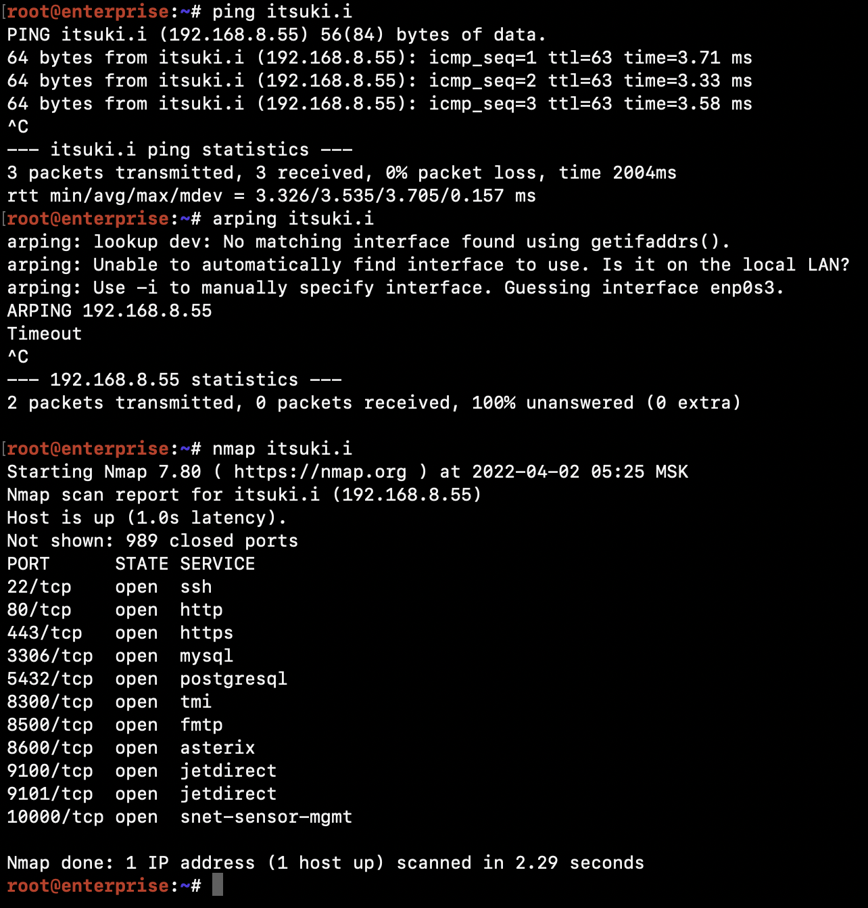
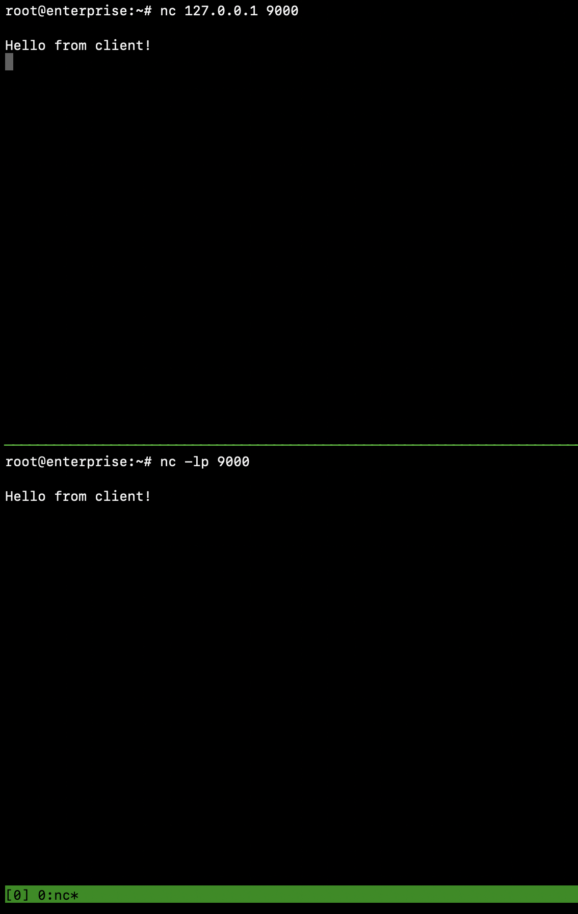
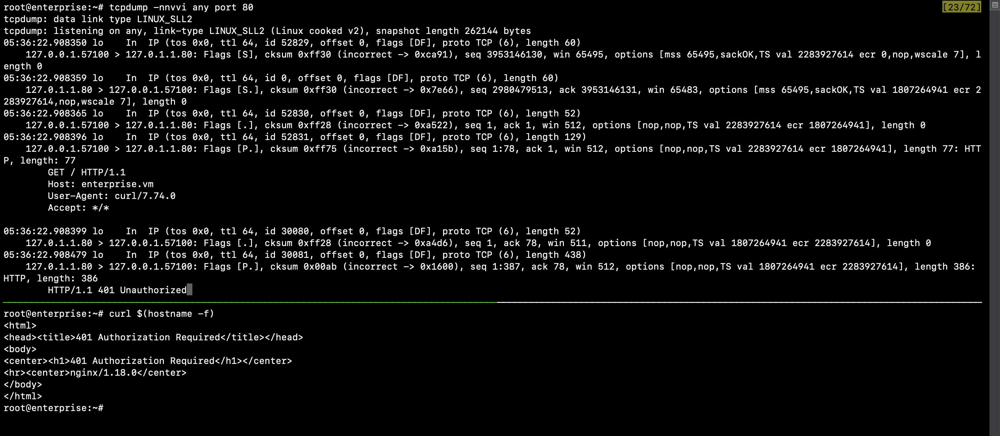
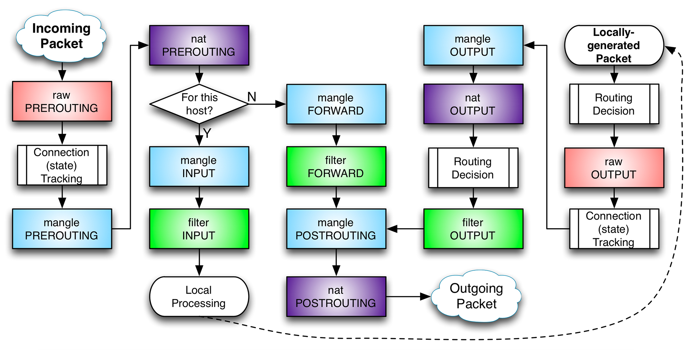
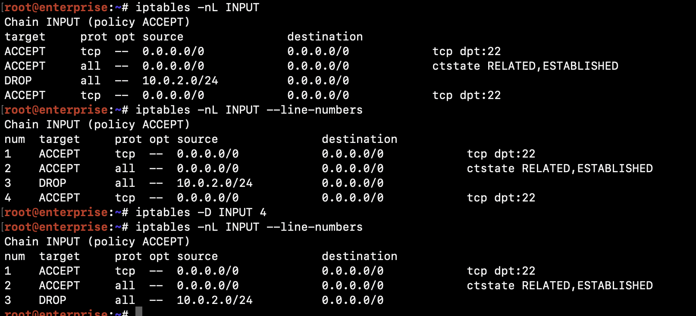
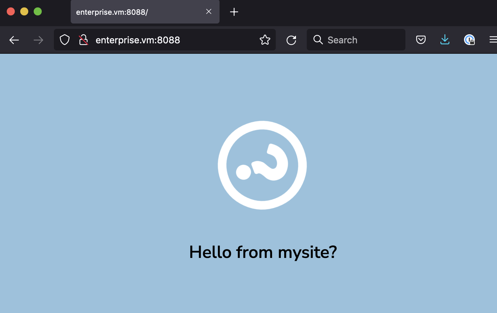

# Лабораторная работа №3. Сетевая подсистема Linux.

**Что потребуется перед началом**:

- Виртуальная машина с установленной GNU/Linux.

**План и задачи лабораторной**:

1. Сетевая подсистема в Linux. Сетевые утилиты.
   - Продемонстрировать ip-адрес виртуальной машины и список интерфейсов и потери пакетов на них
   - Поднять Nginx (с помощью готового Ansible), проверить, показать какие порты он слушает
   - Показать работу утилит curl, wget, nc, telnet
   - Показать работу утилит nmap, traceroute, ping, arping, dig, host
   - tmux, чатик с помощью nc
   - Cнять дамп трафика tcpdump-ом, объяснить
2. Сетевая подсистема в Linux. iptables, SSH-туннели.
   - Настроить iptables, iptables-save, iptables-restore, убедиться в его работе
   - Разрешить доступ c основной ОС, удалить доступ.
   - Поднять ssh-туннель для обхода правил iptables
3. [Дополнительно] Мониторинг

**Отчет** - в любом читаемом формате (pdf, md, doc, docx, pages).

Обязательное содержимое отчета:

0. Фамилия и инициалы студента, номер группы, номер варианта
1. План и задачи лабораторной
2. Часть 1 - кратко описать, что было сделано
3. Часть 2 - кратко описать, что было сделано 
4. Приложить очищенный вывод `history` выполненных команд
5. [Универсальный вывод по лабораторной работе]


## Часть 1:

1. Продемонстрировать ip-адрес виртуальной машины и список интерфейсов и потери пакетов на них

   Утилитами ip и ifconfig (не предустановлен, попробуйте `apt search ifconfig`)

   

   ```bash
   ip -s link
   # Или
   ifconfig
   ```

2. Поднять Nginx (с помощью готового Ansible), проверить, показать какие порты он слушает

   `ansible-playbook deploy-stage.yml --tags nginx`

   `curl enterprise.vm` (`curl` не предустановлен)

   `curl node.enterprise.vm` (но прежде добавить запись в [/etc/hosts](https://man7.org/linux/man-pages/man5/hosts.5.html))

   `netstat -nlpt` || `ss -nlpt` - TCP/LISTEN

   `netstat -nlpu` || `ss -nlpu` - UDP/LISTEN

   Дополнительно: понять, почему `curl enterprise.vm` возвращает *401 Authorization Required*.

3. `wget http://node.enterprise.vm/metrics` - загрузить файл (страницу)

   `nc -vz enterprise.vm 80` - проверить открыт ли порт 80

   `nc -vz enterprise.vm 443` - проверить открыт ли порт 443

   `telnet node.enterprise.vm 80` - установить соединение по текстовому протоклу с 80 портом

   ```
   GET /metrics HTTP/1.0
   Host: node.enterprise.vm
   ```

   

4. Показать работу nmap, traceroute, ping, arping, dig, host. Не предустановлены. Основы сетей с прошлого семестра.

   

5. Netcat - NC. Статья [тут](https://habr.com/ru/post/336596/). Про tmux в [Wiki](./Wiki.md).

   

6. Tcpdump (консольный аналог wireshark) - статья [тут](https://habr.com/ru/company/alexhost/blog/531170/)

   


## Часть 2:

Вводная статья про iptables [тут](https://losst.ru/nastrojka-iptables-dlya-chajnikov). Очень подробное на русском - [тут](https://www.opennet.ru/docs/RUS/iptables/). О том, как работает - [тут](https://www.k-max.name/linux/netfilter-iptables-v-linux/).

[Переход с iptables на nftables](https://habr.com/ru/company/ruvds/blog/580648/).



#### Цепочки netfilter: 

- **PREROUTING** — для изначальной обработки **входящих** пакетов
- **INPUT** — для входящих пакетов, адресованных непосредственно **локальному компьютеру**
- **FORWARD** — для **проходящих** (маршрутизируемых) пакетов
- **OUTPUT** — для пакетов, **создаваемых** локальным компьютером (исходящих)
- **POSTROUTING**— для окончательной обработки **исходящих** пакетов
- Также можно создавать и уничтожать собственные цепочки при помощи утилиты iptables.

#### Цепочки организованны в 4 **таблицы**:

- **raw** — пакет проходит данную таблицу до передачи [системе определения состояний](https://www.k-max.name/linux/netfilter-iptables-v-linux/#conn). Используется редко, например для маркировки пакетов, которые НЕ должны  обрабатываться системой определения состояний. Для этого в правиле  указывается действие *NOTRACK*. Содержитcя в цепочках *PREROUTING* и *OUTPUT*.

- **mangle** — содержит правила модификации (обычно полей заголовка) IP‐пакетов. Среди прочего, поддерживает действия *TTL*, *TOS*, и *MARK* (для изменения полей TTL и TOS, и для изменения маркеров пакета). Редко  необходима и может быть опасна. Содержится во всех пяти стандартных  цепочках.

- **nat** — предназначена для подмены адреса отправителя  или получателя. Данную таблицу проходят только первый пакет из потока,  трансляция адресов или маскировка (подмена адреса отправителя или  получателя) применяются ко всем последующим пакетам в потоке **автоматически**. Поддерживает действия *DNAT*, *SNAT*, *MASQUERADE*, *REDIRECT*. Содержится в цепочках *PREROUTING*, *OUTPUT*, и *POSTROUTING*.

- **filter** — **основная таблица**, используется по умолчанию если название таблицы не указано. Используется для фильтрации пакетов. Содержится в цепочках *INPUT*, *FORWARD*, и *OUTPUT*.

  

[Шпаргалка по правилам iptables](https://www.digitalocean.com/community/tutorials/iptables-essentials-common-firewall-rules-and-commands)


### Часть 2. Iptables.

1. `apt install iptables` && `iptables -A INPUT -s 10.0.2.0/24 -j DROP` - ограничить ВСЕ пакеты из сети.

2. Да, отвалился SSH. Печально. Сбросим `iptables -F` из консоли или ребусом.

3. ```bash
   # Разрешим уже установленные соединения (и наш SSH)
   iptables -A INPUT -m conntrack --ctstate RELATED,ESTABLISHED -j ACCEPT
   
   # Теперь снова попытаемся все сломать:
   iptables -A INPUT -s 10.0.2.0/24 -j DROP
   
   # Выжили, разрешим еще все TCP/22 соединения
   iptables -A INPUT -p tcp -m tcp --dport 22 -j ACCEPT
   
   # SSH текущий ок, новый не работает. Исправляем ситуацию вставив правило выше DROP
   iptables -I INPUT 1 -p tcp -m tcp --dport 22 -j ACCEPT
   ```

4. Удаляем лишнее с помощью `iptables -D`

   

5. Сохраняем с помощью `iptables-save > /etc/iptables.rules.v4`

6. Вносим изменения, восстанавливаем с помощью `iptables-restore < /etc/iptables.rules.v4`

7. Создаем свою цепочку:`iptables -N my-chain`

8. Создаем port-forwarding на 80-ый порт виртуалки. Идем браузером, добиваемся открытия с помощью iptables.

9. Дополнительно: Немного переконфигурим nginx, чтобы открылось что-то красивое.

   

10. Теперь удаляем доступы и запрещаем в iptables ходить на 80-ый порт снаружи. (См часть2, п.3)

    

### Часть 2. SSH-tunnel.

SSH-туннели в PuTTY - [статья](https://putty.org.ru/articles/putty-ssh-tunnels.html).

Классная статья про сложные случаи [тут](https://habr.com/ru/post/331348/).

Руководство для полного новичка [тут](https://selectel.ru/blog/ssh-tunnels/).


Настраиваем ssh-туннель для проброса 80-го порта и пытаемся открыть таким образом себе доступ к запретному. Сработает через NAT, VPN и тройные фаерволы. Лишь бы был ssh!


ssh -L <local_port>:127.0.0.1:<remote_port> <user>@<host>


## Контрольные вопросы

1. Что такое сетевой интерфейс?
2. Что значит слушать порт?
3. Что такое netfilter?
4. Как запретить доступ к серверу по определенному порту?
5. Как указать nginx-у слушать или проксировать на определнный порт?
6. Что могут ssh-туннели?
7. Что может nc?
8. Зачем нам слушать 0.0.0.0?