# Лабораторная работа №4. Docker & GitLab-CI.

**Что потребуется перед началом**:

- Виртуальная машина с установленной GNU/Linux.
- Базовые знания о работе GNU/Linux

**План и задачи лабораторной**:

1. Docker - установка, настройка, запуск контейнера
    - Установить и запустить Docker
    - Поднять готовый контейнер
    - Операции над контейнерами
    - Создание Dockerfile
    - Сборка своего контейнера
    - docker diff
2. GitLab-CI - зачем нужно, настройка, gitlab-runner, написание своего pipeline
    - Регистрация в bmstu.codes, анализ уже готового CI/CD процесса
    - Запуск gitlub-runner-а
    - Добавить в репозиторий .gitlab-ci.yml
    - Продемонстрировать работу автоматизации развертывания

**Отчет** - в любом читаемом формате (pdf, md, doc, docx, pages).

Обязательное содержимое отчета:

0. Фамилия и инициалы студента, номер группы, номер варианта
1. План и задачи лабораторной
2. Часть 1 - кратко описать, что было сделано
3. Часть 2 - кратко описать, что было сделано 
4. Приложить очищенный вывод `history` выполненных команд
5. [Универсальный вывод по лабораторной работе]


## Введение

Итак, мы шли к этому моменту целый семестр. DevOps!

> Для общего понимания принципов и философии DevOps можно послушать две моих презентации “Думай как SRE” и “Философия DevOps”. В рамках курса упор делается на практику и технологии, а не на подходы к разработке и построению рабочих процессов.

И для начала - неплохо бы разобраться, а вообще зачем нам это все? 

Ответ прост: разработчикам понадобилось разделять ресурсы одного мощного сервера на несколько независимых друг от друга окружений. По различным причинам - доступы, разные версии ПО, разные требования к ресурсам. И для этого есть масса инструментов, например, venv в python. Что совершенно не дает изоляции на уровне процессов. Это плохо. Как поддерживать много отдельных сайтов разных клиентов на одном сервере? Они ведь смогут пролезть друг к другу и украсть чужие данные. А еще неплохо бы дать возможность одному клиенту использовать Debian, другому - Centos, а третьему вообще Windows.

Отличная новость: для этого есть решение - виртуализация. Давайте внутри одной операционной системы (основной, “хостовой”) запустим другую (гостевая), пусть основная прикидывается аппаратным обеспечением. ПО, которое позволяет запустить ОС внутри ОС называют гипервизор (hypervisor), например, VirtualBox, VMWare или QEMU-KVM. Вот у нас и полная изоляция (ОС же разные) и разделение окружений (отдельная файловая система) и даже есть возможность прикидываться другой архитектурой процессора (транслируем команды одной архитектуры в другую на уровне хостовой ОС). Такой подход называется эмуляцией. Но у него есть серьезная проблема - получаем огромные накладные расходы на трансляцию команд. Вместо этого, давайте дадим доступ к аппаратному обеспечению напрямую (пусть и ограниченно) для гостевой ОС. Так мы частично потеряем возможность прикидываться другой архитектурой, но придется смириться с этой потерей ради повышения производительности. А еще наше аппаратное обеспечение должно уметь такую виртуализацию поддерживать, из-за чего такой подход называют аппаратной виртуализацией.

Но увы, наше ПО все еще работает медленнее, чем на системе без виртуализации. И эта разница может быть очень значительной. Что же мешает работать быстрее? Взглянем на схему работы  аппаратной виртуализации.


Как это можно оптимизировать? Очевидно, выбросить саму прослойку в виде гостевой ОС. У нас уже есть ядро основной ОС и оно может обрабатывать запросы от приложений. И по принципу бритвы Оккама еще неплохо бы не множить сущности без необходимости, т.е. как-то объединить похожие окружения. Получаем контейнерную виртуализацию - наши процессы исполняются на ядре основной ОС, а мы лишь пытаемся изолировать их друг от друга.


Работает это за счет механизмов linux-namespace, vfs, cgroups, capabilities, netfilter и так далее, часть из которых мы изучали в текущем курсе лабораторных.

Но тут же возникает вопрос, каким образом тогда Docker работает на Windows или MacOS? Ведь сборки есть и они работают. Что ж, тут тоже все просто. Он не работает. На других ОС приложение Docker запускает леговесную виртуальную машину с ядром Linux, поверх которой уже работает все остальное. Костыли.

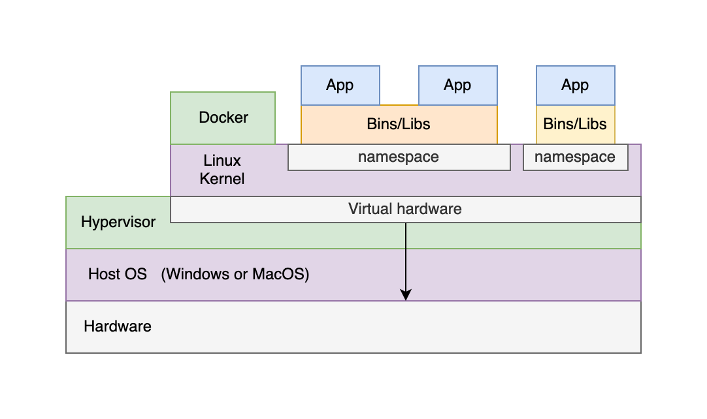

Таким образом, контейнер - это набор изоляций для процессов, работающий поверх нашего ядра Linux. А сеть для него настраивается правилами netfilter. Никакой магии.


## Часть 1.

Устанавливаем Docker по [документации](https://docs.docker.com/engine/install/debian/).

```bash
# Качаем ключ
curl -fsSL https://download.docker.com/linux/debian/gpg | sudo gpg --dearmor -o /usr/share/keyrings/docker-archive-keyring.gpg

# Добавляем репозиторий
echo \
  "deb [arch=$(dpkg --print-architecture) signed-by=/usr/share/keyrings/docker-archive-keyring.gpg] https://download.docker.com/linux/debian \
  $(lsb_release -cs) stable" | sudo tee /etc/apt/sources.list.d/docker.list > /dev/null
  
# Ставим
sudo apt update
sudo apt install docker-ce docker-ce-cli containerd.io docker-compose-plugin
```

> Нужно обязательно обновить apt cache (`apt update`) после добавления нового репозитория.

Проверяем:

```bash
sudo docker run hello-world
```

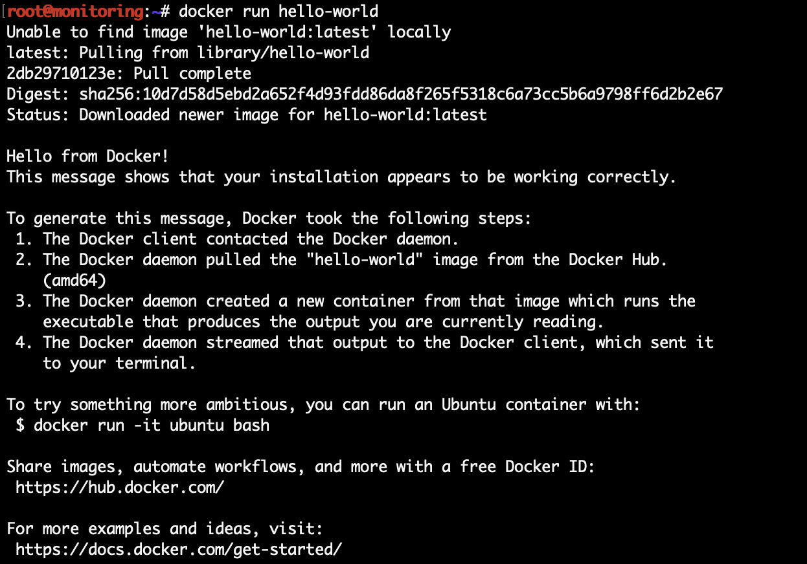

> Стоит ознакомиться с предлагаемыми возможностями и руководствами

Теперь нам предстоит запустить свой первый настоящий контейнер (помимо hello-world), с python на борту.

```bash
sudo docker run -it python:3.8-slim-buster bash
```


Смотрим список образов:

```bash
sudo docker image ls
```

Смотрим список запущенных контейнеров (пуст):

```bash
sudo docker ps
```

Смотрим список всех контейнеров (2 завершенных):

```bash
sudo docker ps --all
```

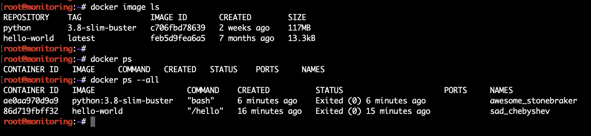

Образ можно представить себе как набор расширений вокруг некого базового образа:

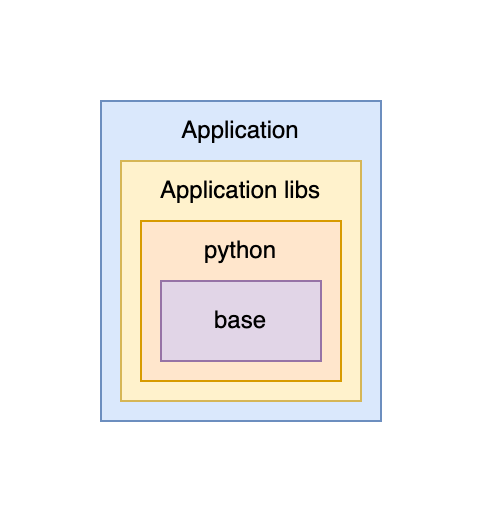

Каждая следующая “обертка” добавляет какой-то функционал. И верхняя обертка, как правило, код или сборка нашего ПО. Соответственно контейнер это набор из образа и команды которая запускает определенное ПО из образа и выполняет определенную задачу. Как только команда, запустившая образ завешена - контейнер остановится. Так, в примере с python-образом я запустил контейнер с командой bash и когда интерпретатор завершился - остановился и контейнер.

Попытка запустить образ без опций (`docker run python:3.8-slim-buster`) в данном случае приводит к тому, что там запускается команда, зашитая в образ (python), интерпретатор без псевдотелетайпа завершается, контейнер останавливается.

> Лучше вспомнить про tmux сейчас

Теперь попробуем запустить что-то более осмысленное и не в интерактивном режиме:

```bash
sudo docker run python:3.8-slim-buster python3 -m http.server 8000
```

В соседней консоли видим запущенный контейнер:

```bash
sudo docker ps
```


Однако `netstat -nlpt | grep 8000` не покажет ни одного приложения, слушающего 8000 порт. Это из-за изоляции. Контейнер имеет свой собственный сетевое пространство имен. Вот там этот порт слушается. Проверим, подключившись внутрь контейнера с помощью `docker exec`:

```bash
sudo docker exec -it 3ee16e5e9686 bash
```

Внутри самый обычный linux, в данном случае debian-дистрибутив. Поставим руками net-tools и проверим 8000 порт:

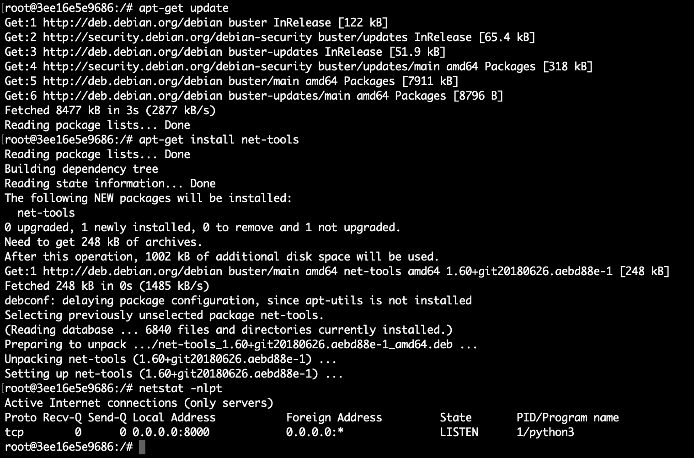

Слушается. Отлично. Теперь остановим наш контейнер. Это можно сделать нажав `^C` в консоли, где мы его запустили. Либо убив контейнер через docker:

```bash
sudo docker stop 3ee16e5e9686
```

Он пошлет сигнал SIGTERM процессу контейнера для завершения. Если тот не успеет завершиться за 10 секунд (настраивается ключом `-t`), то пошлет SIGKILL.

Но хотелось бы получить к нему доступ из нашей основной системы. Для этого нужно запустить контейнер с ключом `-p` + `-d` флаг для удобства (запустить в фоне, detached):

```bash
sudo docker run -dp 8080:8000 python:3.8-slim-buster python3 -m http.server 8000
```

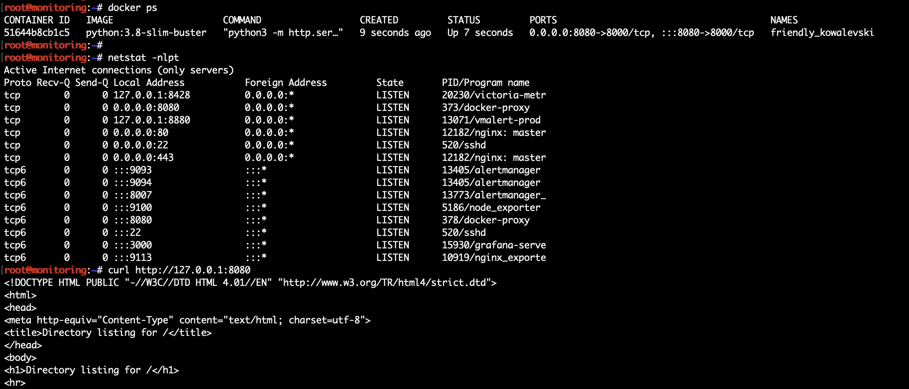

Посмотрим логи контейнера за последние 120 секунд (пусты):

```bash
sudo docker logs --until=120s 51644b8cb1c5
```

Теперь соберем свой образ ([так](https://docs.docker.com/language/python/build-images/)). Для этого нам потребуется приложение (`app.py` + `requirements.txt`) и Dockerfile.

Файл `app.py` (вообще-то любое приложение):

```python
from flask import Flask
app = Flask(__name__)

@app.route('/')
def hello_world():
    return 'Hello, Docker!'
```

Файл ``requirements.txt``, можно сгенерировать `pip3 freeze > requirements.txt`:

```
Flask==2.1.2
```

Файл `Dockerfile`:

```dockerfile
# syntax=docker/dockerfile:1

FROM python:3.8-slim-buster

WORKDIR /app

COPY requirements.txt requirements.txt
RUN pip3 install -r requirements.txt

COPY . .

CMD [ "python3", "-m" , "flask", "run", "--host=0.0.0.0"]
```

Собираем:

```bash
sudo docker build --tag my-super-app .
```

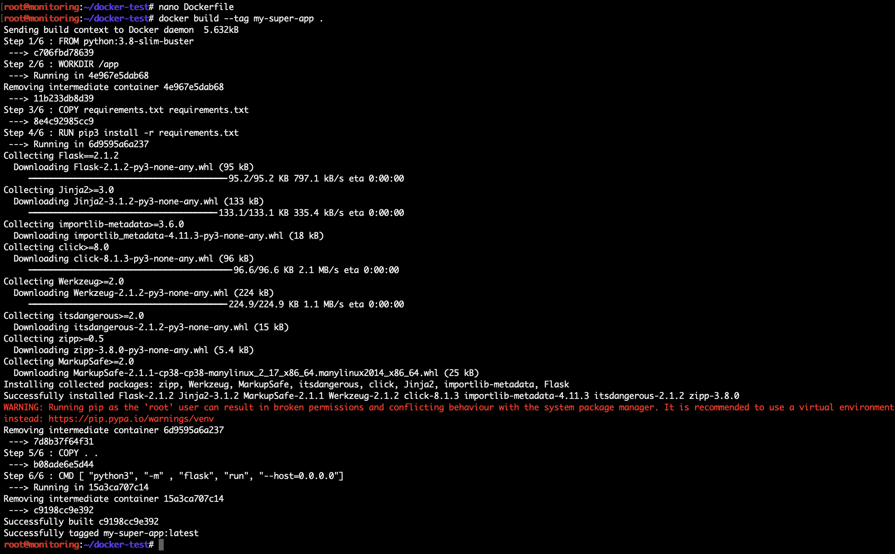

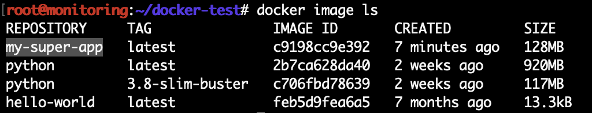

Образа можно тэгать (именовать):

```bash
sudo docker tag my-super-app:latest my-super-app:v0.1.0
```

Можно удалять:

```bash
sudo docker rmi my-super-app:v0.1.0
```

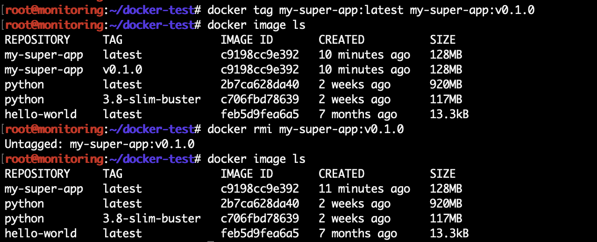

Теперь запустим наш образ (можно добавить `--name ИМЯ` чтобы выбрать имя, иначе будет сгенерированное, в примере - great_turing):

```bash
sudo docker run -dp 8080:5000 my-super-app
```

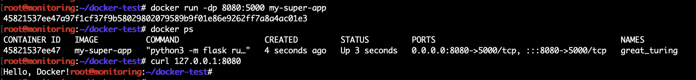


Создадим сеть:

```bash
sudo docker network create mysqlnet
```

 Запустим в контейнере с отдельным диском MySQL:

```bash
sudo docker run --rm -d -v mysql:/var/lib/mysql \
  -v mysql_config:/etc/mysql -p 3306:3306 \
  --network mysqlnet \
  --name mysqldb \
  -e MYSQL_ROOT_PASSWORD=p@ssw0rd1 \
  mysql
```

Подключимся к базе для проверки:

```bash
sudo docker exec -ti mysqldb mysql -u root -p
```

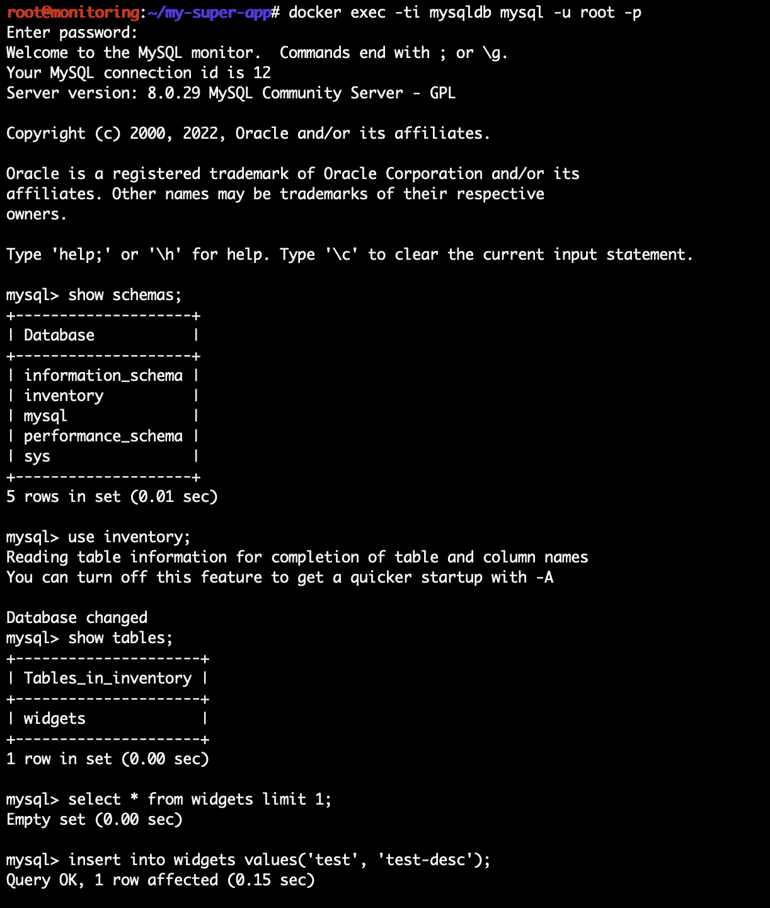


Создадим более сложное приложение:

```python
import mysql.connector
import json
from flask import Flask

app = Flask(__name__)

db_host = "my-super-storage"
db_user = "root"
db_pass = "p@ssw0rd1"
db_name = "inventory"

@app.route('/')
def hello_world():
  return 'Hello, Docker!'

@app.route('/widgets')
def get_widgets():
  mydb = mysql.connector.connect(
    host=db_host,
    user=db_user,
    password=db_pass,
    database=db_name
  )
  cursor = mydb.cursor()


  cursor.execute("SELECT * FROM widgets")

  row_headers=[x[0] for x in cursor.description] #this will extract row headers

  results = cursor.fetchall()
  json_data=[]
  for result in results:
    json_data.append(dict(zip(row_headers,result)))

  cursor.close()

  return json.dumps(json_data)

@app.route('/initdb')
def db_init():
  mydb = mysql.connector.connect(
    host=db_host,
    user=db_user,
    password=db_pass
  )
  cursor = mydb.cursor()

  cursor.execute("DROP DATABASE IF EXISTS inventory")
  cursor.execute("CREATE DATABASE inventory")
  cursor.close()

  mydb = mysql.connector.connect(
    host=db_host,
    user=db_user,
    password=db_pass,
    database=db_name
  )
  cursor = mydb.cursor()

  cursor.execute("DROP TABLE IF EXISTS widgets")
  cursor.execute("CREATE TABLE widgets (name VARCHAR(255), description VARCHAR(255))")
  cursor.close()

  return 'init database'

if __name__ == "__main__":
  app.run(host ='0.0.0.0')
```

Не забудем обновить зависимости:

```bash
pip3 install mysql-connector-python
pip3 freeze | grep mysql-connector-python >> requirements.txt
```

Еще раз соберем образ:

> Более правильно будет использовать `docker buildx` для сборки под [мультиплатформу](https://www.docker.com/blog/multi-arch-images/)

```bash
sudo docker build --tag my-super-app .
```

Запустим:

```bash
sudo docker run \
  --rm -d \
  --network mysqlnet \
  --name rest-server \
  -p 8080:5000 \
  my-super-app
```

Проверим:

```bash
curl http://localhost:8080/initdb
curl http://localhost:8080/widgets
```

Можно узнать, что изменил локально конкретный контейнер от образа:

```bash
sudo docker diff rest-server
```

Остановим все принудительно:

```bash
sudo docker kill $(sudo docker ps -q)
```


 Не очень удобно каждый раз запускать все микросервисы вручную? Есть docker-compose.

```bash
sudo apt install docker-compose
```

Файл `docker-compose.yml`:

```yaml
version: '3.3'

services:
 my-super-app-api:
  build:
   context: .
  ports:
  - 8080:5000
  networks:
    my_super_net:

 my-super-storage:
  image: mysql
  ports:
  - 3306:3306
  environment:
  - MYSQL_ROOT_PASSWORD=p@ssw0rd1
  volumes:
  - mysql:/var/lib/mysql
  - mysql_config:/etc/mysql
  networks:
    my_super_net:

volumes:
  mysql:
  mysql_config:

# У меня просто сеть пересекается с дефолтной 172.X.Y.Z
networks:
  my_super_net:
    driver: bridge
    ipam:
      driver: default
      config:
        - 
          subnet: 192.168.2.0/24
```

> By default Compose sets up a single [network](https://docs.docker.com/engine/reference/commandline/network_create/) for your app. Each container for a service joins the default network and is both *reachable* by other containers on that network, and *discoverable* by them at a hostname identical to the container name.

Запустим - он сам соберет и запустит все, что нужно:

```bash
sudo docker-compose up -d

# Или более полно:
sudo docker-compose -f docker-compose.yml up --build -d
```

Остановить:

```bash
sudo docker-compose down
```

Удалить и volumes:

```bash
sudo docker-compose down -v
```


## Часть 2

Заходим в gitlab, создаем проект, смотрим в CI/CD раздел:


Запускаем у себя создание раннера:

```bash
sudo docker run -d -v /var/run/docker.sock:/var/run/docker.sock -v gitlab-runner-config:/etc/gitlab-runner gitlab/gitlab-runner:latest
```

Регистрируем:

```bash
sudo docker run --rm -it -v gitlab-runner-config:/etc/gitlab-runner gitlab/gitlab-runner:latest register --locked=false
```

Ждем, пока на странице раннеров он станет активен.


Пушим в репозиторий .gitlab-ci.yml:

```yaml
stages:
  - test
  - build
  - upload

run tests:
  image: python:3.8-slim-buster
  stage: test
  script:
    - python --version
    - echo "DONE!"

build image:
  image: docker:latest
  stage: build
  services:
    - docker:dind
  before_script:
    - docker login -u $CI_REGISTRY_USER -p $CI_REGISTRY_PASSWORD $CI_REGISTRY
  script:
    - docker build --pull -t $CI_REGISTRY_IMAGE .
    - echo $CI_REGISTRY_IMAGE
  only:
    - master

upload image:
  image: docker:latest
  stage: upload
  services:
    - docker:dind
  when: manual
  before_script:
    - docker login -u $CI_REGISTRY_USER -p $CI_REGISTRY_PASSWORD $CI_REGISTRY
  script:
    - docker build --pull -t $CI_REGISTRY_IMAGE .
    - echo $CI_REGISTRY_IMAGE
    - docker push $CI_REGISTRY_IMAGE
  only:
    - master
```

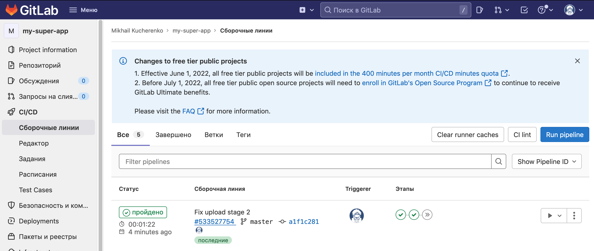

После выполнения ручного этапа должны увидеть в registry свой образ:

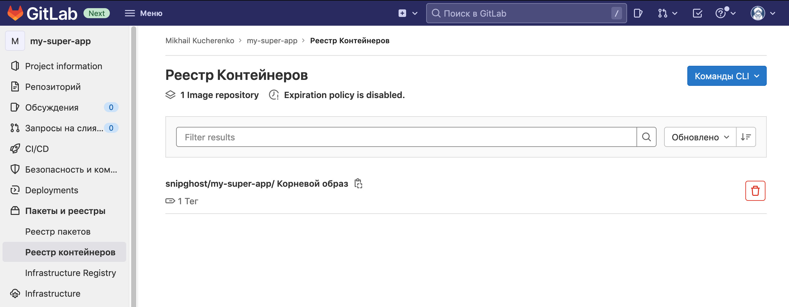


## Контрольные вопросы

1. Что такое виртуализация, контейнерная виртуализация?
2. Как собрать образ контейнера?
3. Я запустил контейнер, а в списке запущенных его нет, что делать?
4. Как обратиться в контейнер на 80-ый порт с хостовой ОС?
5. Может ли контейнер запуститься с командой, отличной от указанной в dockerfile
6. Как аутентифицироваться в приватном registry?