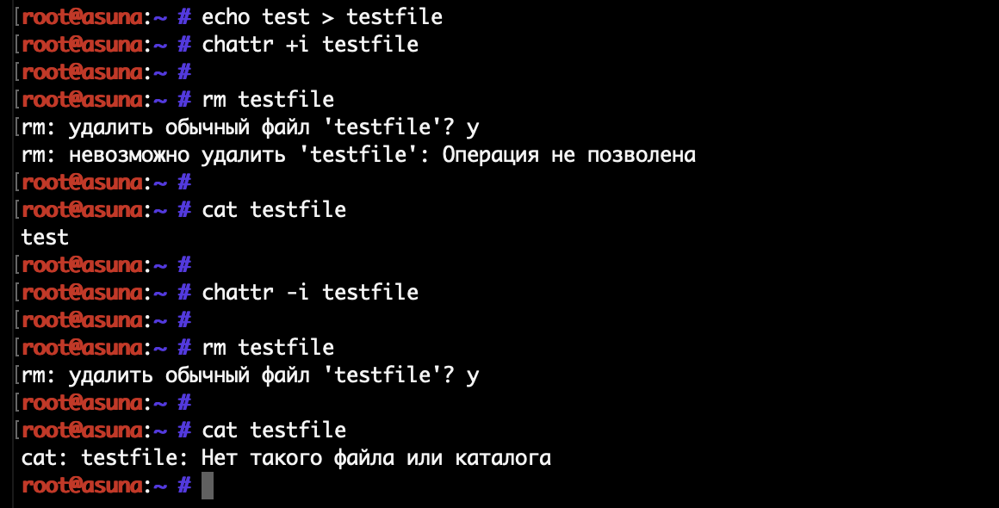
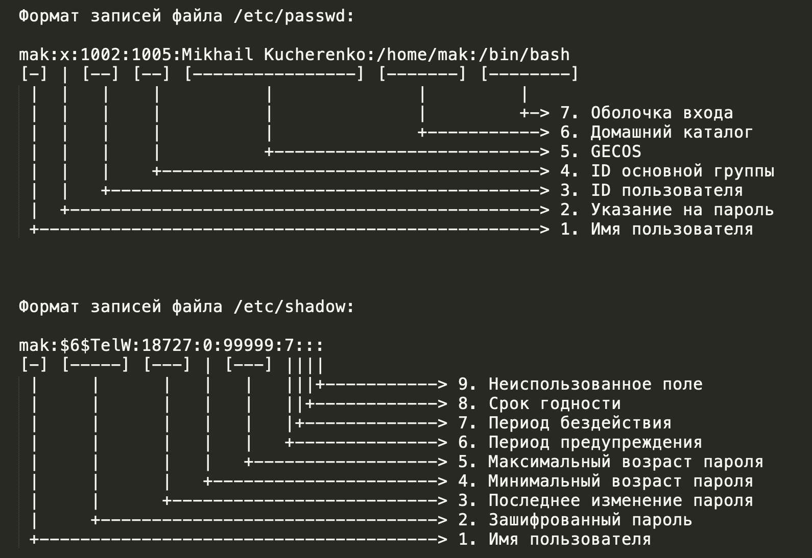
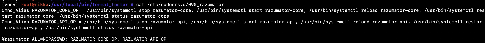
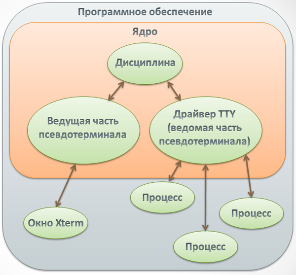
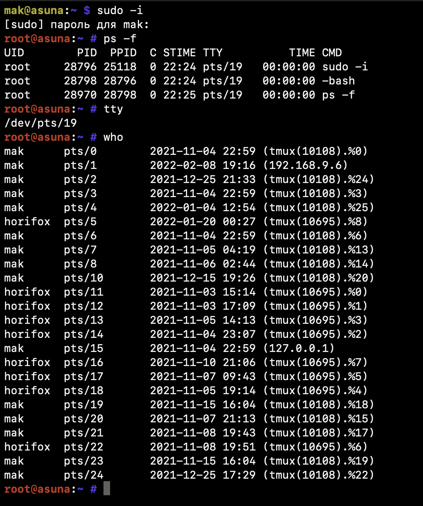

# Справочные материалы

Универсальный сборник статей по наиболее важным темам GNU/Linux.

## Терминология

### POSIX

**[POSIX](https://ru.wikipedia.org/wiki/POSIX)** (англ. **P**ortable **O**perating **S**ystem **I**nterface — переносимый интерфейс операционных систем) — набор стандартов, описывающих интерфейсы между операционной системой и прикладной программой (системный API), библиотеку языка C и набор приложений и их интерфейсов. Если коротко - стандарт о том, как должны работать идеальные операционные системы.

### Unix

**[Unix](https://ru.wikipedia.org/wiki/Unix)** — семейство переносимых, многозадачных и многопользовательских операционных систем, которые основаны на идеях оригинального проекта AT&T Unix, разработанного в 1970-х годах в исследовательском центре Bell Labs Кеном Томпсоном, Деннисом Ритчи и другими. Операционные системы семейства Unix характеризуются модульным дизайном, в котором каждая задача выполняется отдельной утилитой, взаимодействие осуществляется через единую файловую систему, а для работы с утилитами используется командная оболочка.

### Linux & GNU/Linux

**[Linux][linux-core]** - ядро операционной системы, написано на Си, открытое ПО. Часто под Linux некорретно подразумевают всю ОС.
**[GNU/Linux][linux-os]** - семейство операционных систем на основе ядра Linux и программ проекта GNU. Не являются системами семейства Unix, однако работают по схожим принципам, частично соответствуют стандартам POSIX и признаются Unix-подобными.

 ### Дистрибутив GNU/Linux

**[Дистрибутив GNU/Linux][distro]** - общее определение операционных систем, использующих ядро Linux, готовых для конечной установки на пользовательское оборудование. Поставляемая в рамках дистрибутива операционная система состоит из ядра Linux и, как правило, включает в себя набор библиотек и утилит, выпускаемых в рамках проекта [GNU](https://ru.wikipedia.org/wiki/GNU), а также, если необходимо, графическую подсистему [X Window System](https://ru.wikipedia.org/wiki/X_Window_System) и набор приложений для нее.

### Unix-way

**[Unix-way][unix-way]** - философия UNIX, как и любая философия может быть крайне абстрактной, обширной и спорной. Подхвачено в GNU/Linux. Сводится, как правило, к:

- Пишите программы, которые делают что-то одно и делают это хорошо.
- Пишите программы, которые бы работали вместе.
- Пишите программы, которые бы поддерживали текстовые потоки, поскольку это универсальный интерфейс

### Syscall - системный вызов

**[Syscall][syscall]** - системный вызов, обращение программы к ядру операционной системы для выполнения какой-либо операции. Например, для открытия и чтения файла. С точки зрения программиста высокого уровня можно сказать, что Ядро ОС - это такая хитрая библиотека, методы которой мы дергаем. Вот эти методы и называются системными вызовами.

На самом деле, с точки зрения программиста (особенно Си-программиста), мы действительно всегда дергаем библиотеку - библиотеку [libc][libc] (ныне - glibc), где уже реализуются обращения к системным вызовам ядра. Дополнительная прослойка в виде libc значительно улучшает стабильность работы программ с ядром, закрепляя единый интерфейс взаимодействия, но при этом позволяя значительно изменять логику работы ядра вместе с libc.

### Каталог

**[Каталог][dir-term]** - оно же директория, оно же папка. Вообще-то тоже файл, но об этом дальше.

### Файл

**[Файл][file]** - в терминах Linux - всё. Буквально. Любой организованный массив байт на диске, сам диск, сетевое соединение, каталоги. И это универсальный способ взаимодействия с чем угодно, без необходимости понимать как оно работает. Все это работает за счет файловой подсистемы Linux на основе VFS.

### Дескриптор

**[Дескриптор][descriptor]** - нечто, что однозначно идентифицирует объект. В терминах Linux, как правило, дескриптор - числовой идентификатор.

### Файловый дескриптор

**[Файловый дескриптор][fd]** - он же fd (file descriptor), целое неотрицательное число. Когда создается новый поток ввода-вывода (например, при открытии файла), ядро возвращает процессу, создавшему поток ввода-вывода, его файловый дескриптор. Копия таблицы дескрипторов (читай: таблицы открытых файлов внутри процесса) скрыта в ядре. Мы не можем получить прямой доступ к этой таблице, как при работе с окружением через environ. Каждый процесс имеет свою копию таблицы дескрипторов. В пределах одного процесса все дескрипторы уникальны (даже если они соответствуют одному и тому же файлу или устройству). В разных процессах дескрипторы могут совпадать или не совпадать - это не имеет никакого значения, поскольку у каждого процесса свой собственный набор открытых файлов. Подробно о работе дескрипторов и подсистемы ввода/вывода можно почитать [тут][hard-io].

### Процесс

**[Процесс][process-article] (задача)** – абстракция, описывающая выполняющуюся в рамках ОС программу. Для ОС процесс – единица работы, которая потребляет  системные ресурсы.

Стандарт ISO 9000:2000 Definitions определяет процесс как совокупность  взаимосвязанных и взаимодействующих действий, преобразующих входящие  данные в исходящие.

### Поток

**[Поток][thread-wiki] выполнения** (от англ. thread — нить) — наименьшая единица обработки, исполнение которой может быть назначено ядром операционной системы. Реализация потоков выполнения и процессов в разных операционных системах отличается друг от друга, но в большинстве случаев поток выполнения находится внутри процесса. Применительно к Linux - поток это легковесный, но все же процесс.

Несколько потоков выполнения могут существовать в рамках одного и того же процесса и совместно использовать ресурсы, такие как память, тогда как процессы не разделяют этих ресурсов. В частности, потоки выполнения разделяют последовательность инструкций процесса (его код) и его контекст — значения переменных (регистров процессора и стека вызовов), которые они имеют в любой момент времени.

В Linux каждый поток является процессом, и для того, чтобы создать новый поток, нужно создать новый процесс. В чем же, в таком случае, заключается преимущество многопоточности Linux перед многопроцессностью? В многопоточных приложениях Linux для создания дополнительных потоков используются процессы особого типа. Эти процессы представляют собой обычные дочерние процессы главного процесса, но они разделяют с главным процессом адресное пространство, файловые дескрипторы и обработчики сигналов. Для обозначения процессов этого типа, применяется специальный термин – легкие процессы (lightweight processes). Прилагательное «легкий» в названии процессов- потоков вполне оправдано. Поскольку этим процессам не нужно создавать собственную копию адресного пространства (и других ресурсов) своего процесса- родителя, создание нового легкого процесса требует значительно меньших затрат, чем создание полновесного дочернего процесса. Поскольку потоки Linux на самом деле представляют собой процессы, в мире Linux нельзя говорить, что один процесс содержит несколько потоков. Подробно об этом можно почитать [тут][thread-article].

### Командная оболочка

**[Кома́ндная оболо́чка Unix]((https://ru.wikipedia.org/wiki/Командная_оболочка_UNIX) )** (англ. Unix shell, часто просто «шелл» или «sh») — командный интерпретатор, используемый в операционных системах семейства Unix, в котором пользователь может либо давать команды операционной системе по отдельности, либо запускать скрипты, состоящие из списка команд.

На данный момент самой популярной командной оболочкой является [Bash](https://ru.wikipedia.org/wiki/Bash) (born again shell) - усовершенствованная и модернизированная вариация командной оболочки Bourne shell. Представляет собой командный процессор, работающий, как правило, в  интерактивном режиме в текстовом окне. Bash также может читать команды  из файла, который называется [скриптом](https://ru.wikipedia.org/wiki/Скрипт) (или *сценарием*). Как и все Unix-оболочки, он поддерживает автодополнение имён файлов и каталогов (по нажатию Tab), подстановку вывода результата команд, переменные, контроль  над порядком выполнения, операторы ветвления и цикла. Ключевые слова, синтаксис и другие основные особенности языка были заимствованы из sh. Другие функции, например, история, были скопированы из [csh](https://ru.wikipedia.org/wiki/Csh) и [ksh](https://ru.wikipedia.org/wiki/Ksh). Bash в основном соответствует стандарту [POSIX](https://ru.wikipedia.org/wiki/POSIX), но с рядом расширений.

### Команда

Команда - это текстовая строка, содержащая название программы и параметры, которую пользователь вводит в командой оболочке для выполнения определённой задачи. Команды могут иметь дополнительные данные и опциональные параметры, иногда называемые ключами. Примеры команд: `ls -la`, `pwd`, `cd /var/log`.

### Терминал, консоль, CLI

**Терминал**, в общем понимании - устройство, используемое для взаимодействия пользователя (или оператора) с компьютером или компьютерной системой, локальной или удалённой.

**Интерфейс командной строки** (англ. *Command line interface, **CLI***), также **консоль** — разновидность текстового интерфейса (TUI) между человеком и компьютером, в котором инструкции компьютеру даются в основном путём ввода с клавиатуры текстовых строк (*команд*). CLI часто противопоставляется гораздо более требовательному к ресурсам графическому интерфейсу (GUI). Применяется для выполнения административных задач, например: установка пакетов, действия с файлами и управление пользователями.

Сейчас под терминалом часто понимают CLI, но с терминологической точки зрения это не совсем верно. На данный момент термин *терминал* применяется как наименование группы программ **эмуляторов терминала**, которые используются для взаимодействия с командной оболочкой. В MacOS это Terminal, iTerm, MacTerm и так далее. В Windows - PowerShell. В каждом дистрибутиве GNU/Linux для разных графических оболочек также существует свой эмулятор терминала, например, Xterm.

### TTY, PTS

**Телетайп** (англ. teletype, **TTY**) - электромеханическая печатная машина, используемая для передачи между двумя абонентами текстовых сообщений по простейшему электрическому каналу (обычно по паре проводов). Наиболее совершенные телетайпы являются полностью электронными устройствами и используют дисплей вместо принтера. Телетайп стал идеальным кандидатом для использования в качестве устройства ввода-вывода в зарождавшейся компьютерной технике. Телетайпы стали стандартным средством взаимодействия с мини-компьютерами и большими мейнфреймами той эпохи. С течением времени телетайпы были заменены на электронные устройства, которые имитировали электромеханическое строение телетайпов и допускали доселе невозможные функции, такие как: перемещение курсора по экрану, очистка экрана, выделение текста жирным шрифтом и так далее.

В GNU/Linux для взаимодействия пользователя и системы используется **подсистема TTY**, которая является прямым наследником технологии телетайпов. **PTS** - псевдо-телетайп, от англ. "**p**seudo-**t**eletype**s**". Подробнее об этом читайте в разделе "Работа с системой" -> "Подсистема TTY".


## Файлы, каталоги, права

### Работа с каталогами и файлами

**`ls`** — покажет содержимое директории, в которой вы  находитесь. Если после команды ввести адрес конкретной папки, то она  покажет то, что хранится в ней.  
	Полезные аргументы:  
	**-R** в выводе команды появятся файлы из поддиректорий  
	**-l** отобразить списком с метаданными (права доступа и прочая информация из inode)  
	**-a** отобразить скрытые (начинающиеся с точки) объекты

**`cd`** — change directory, сменить директорию. Из названия понятно, что с помощью этой команды  можно перемещаться между каталогами. Вписываем её, а потом путь, например: `cd /path/to/dir`.  
	Есть сокращенные варианты:  
	`cd -` для перемещения в  предыдущую директорию  
	`cd` (без аргументов) для прыжка в домашнюю папку

**`cp`** - copy - скопировать объект. Из полезных опций **-r** позволяет делать рекурсивно (для всех подкаталогов) и **-p** позволяет сохранить все права на файл как у исходного.

**`mv`** - move - переместить объект.

**`pwd`** — укажет полный путь до директории, в которой вы находитесь. Если вы перепрыгнули на рабочий стол с помощью `cd  ~/Desktop/`, то `pwd` покажет что-то вроде `/home/mak/Desktop`.

**`mkdir путь`** - создает каталог. С опцией **-p** создает все промежуточные отсутствующие каталоги тоже.

**`dd`** — мощная утилита для взаимодействия с "сырыми" блоками данных. С её помощью можно делать копии разделов, перемещать их, удалять без возможности восстановления. Поскольку в GNU/Linux многие объекты (жёсткие/гибкие диски, COM/LPT-порты, оперативная память компьютера, память с кодом/данными каждого процесса) представлены в виде специальных файлов, спектр применения утилиты `dd` гораздо шире, чем кажется на первый взгляд. Регулярно возникает необходимость не просто скопировать файл или несколько файлов (для чего предназначена утилита cp), а скопировать первые n байт файла, пропустить m байт от начала, прочитать файл с дефектного носителя, транслировать содержимое файла в ASCII, «развернуть» порядок байтов в файле (Little-Endian vs. Big-Endian), просто скопировать очень большой файл или всё вместе взятое. Кроме всего прочего, данная утилита позволяет скопировать регионы из файлов «сырых» устройств, например, сделать резервную копию загрузочного сектора жёсткого диска, или прочитать фиксированные блоки данных из специальных файлов, таких, как `/dev/zero` или `/dev/random`. Название утилиты `dd` иногда в шутку расшифровывают, как «disk destroyer», «data destroyer», «delete data» или «добей диск», так как утилита позволяет производить низкоуровневые операции на жёстких дисках — при малейшей ошибке (такой, как реверс параметров if и of) можно потерять часть данных на диске или даже все данные вместе с разметкой и резервными блоками загрузчика.

**`rm`** — команда для удаления файлов, каталогов и их содержимого. Удаляет жесткие ссылки, фактически данные остаются на диске, просто мы теряем на них указатели и эти блоки данных теперь считаются пустыми. На форумах часто ходит злая шутка для новичков, которым советуют починить что-нибудь в их систему с помощью `rm -rf /`, что потенциально стирает все данные.  
	Полезные аргументы:  
	**-r** удалить каталог и все вложенные объекты  
	**-f** удалить без подтверждения

**`grep`** — это полнотекстовый поиск в файле. Очень полезная команда, когда вам нужно что-то найти. Например, `grep значение  /путь/до/файла` покажет строки в которых есть «значение». А команда `grep -ril значение /путь/до/каталога/*` покажет все файлы, в которых есть искомое значение.  
	Полезные аргументы:  
	**-r** рекурсивный поиск  
	**-i** игнорировать регистр (case **i**nsensetive)  
	**-l** вывести результат списком  
	**-v** инвертировать работу - пропускать только строки, в которых **НЕТ** значения  
	**-E** использовать регулярные выражения в "значении"

**`chown пользователь:группа путь`** — команда позволяет изменить владельца файла или каталога. **-R** для рекурсивного.

**`chmod права путь`** — изменяет права на файл или каталог. Подробнее в разделе "Система прав в GNU/Linux".

**`find`** — с помощью этой утилиты можно искать (и даже удалять) файлы по определённым параметрам. Например: `find /mnt/data/backup/ -mtime +3 -type f -iname "*.sql.gz"` - выведет все файлы (`-type f`) в директории `/mnt/data/backup` 3-х дневной давности (дата изменения modify time +3 - `-mtime +3`) с именем попадающим в маску `*sql.gz`. При добавлении опции `-delete` удаляет найденные файлы. Часто используется в таком виде в скриптах для очистки старых логов или резервных копий.

**`mkfifo`** - создает именованный канал, позволяет процессами обмениваться через него данными, как через файл, но общение происходит в обе стороны. Чем-то похож на сетевой сокет.

### Типы файлов в GNU/Linux.

В выводе `ls -l` в первой колонке можно наблюдать последовательности символов, например:
`-rwxr-xr-x` или `drwxrwx---`. Первым символом идет тип файла:

- `–` : regular file - текстовые, исполняемые, в общем, просто организованная последовательность байт на диске.
- `d` : directory - каталоги, содержит ссылки на другие файлы.
- `c` : character device file - символьные устройства, с  которыми система общается посылая или принимая по 1 символу (байту),  например: старые аудио- и видео-карты, устройства ввода - клавиатура и  мышь.
- `b` : block device file - блочные устройства, например жесткие диски. Считывать и записывать информацию на блочные устройства можно в произвольном порядке, причем блоками определенного размера.
- `s` : local socket file - сокет, структура, необходима для двунаправленного обмена данными между несколькими процессами.
- `p` : named pipe - именованый канал, позволяет процессами  обмениваться через него данными. Как конвейер, но лежит на файловой  системе. Конвейер же существует только в рамках ядра.
- `l` : symbolic link - символическая "мягкая" ссылка, это обсудим в лабораторной №2.

Далее следует последовательность, кодирующая режим доступа к файлу. Об этом в разделе “Система прав в GNU/Linux”

### Система прав в GNU/Linux

Каждый файл имеет специальные атрибуты – права на доступ. Эти атрибуты должны сообщать, кто имеет право работать с файлом.

Существует три категории пользователей, для которых можно устанавливать различные сочетания прав доступа:

- **Владелец**  (Owner - u) - конкретный пользователь, чье имя числится в атрибутах файла как имя  владельца этого файла. Обычно если пользователь создает файл, то он  автоматически записывается как его владелец (но это поведение можно изменить).
- **Группа** (Group - g) - любая группа пользователей, существующая в системе и привязанная к файлу. Может быть указана только одна группа.
- **Остальные** (Others - o) - все пользователи, кроме владельца и пользователей, входящих в группу файла.

Кроме того существует три параметра доступа:

- **Чтение** (Read - r) - разрешает получать содержимое файла. Для каталога позволяет получить список файлов и каталогов,  расположенных в нем.
- **Запись** (Write - w) - разрешает записывать новые данные в файл или изменять существующие, а также позволяет создавать и изменять файлы и подкаталоги для каталогов.
- **Выполнение** (eXecute - x) - разрешает “исполнять” файл, т.е. запускать содержимое как программу. Это могут быть интерпретируемые скрипты или бинарные файлы. При этом в файле должны быть записаны инструкции для системы о том, как его исполнять. Для интерпретируемых языков это указание к интерпретатору (например, python или bash), для собранных программ (например, си и golan) это готовые инструкции процессора.


Первые три записи – это права владельца, вторые три записи – права группы, последняя тройка – права на файл для всех остальных. Нетрудно догадаться, что такая запись легко представима в виде числовых значений, а именно групп из трех бит. Каждая группа отвечает за свою категорию пользователей. Если параметр доступа для группы разрешен, то устанавливается 1, иначе - 0.

Частые примеры прав доступа:

|      Запись | Число | Расшифровка                                                  |
| ----------: | :---: | ------------------------------------------------------------ |
| `rwxrwxrwx` |  777  | Всем можно все                                               |
| `rwxr-xr-x` |  755  | Владелец может все, остальные читать и исполнять             |
| `rw-r-----` |  640  | Владелец может читать и писать, группа читать, остальные ничего |
| `rw-rw-r--` |  664  | Владелец и группа могут читать и писать, остальные читать    |
| `r--------` |  400  | Ткой файл сможет редактировать только суперпользователь      |

Параметры доступа изменяются утилитой `chmod`: `chmod mode file`, например: `chmod 755 file`
Владелец и группа - `chown`: `chown user:group file`, например: `chown root:wheel file`

Еще для `chmod ` можно указывать категорию пользователей:

|  Запись | Расшифровка                                          |
| ------: | ---------------------------------------------------- |
|  `u+rw` | Добавить владельцу права на чтение и запись          |
|  `g+rx` | Добавить группе права на чтение и исполнение         |
| `ug+rw` | Добавить владельцу и группе права на чтение и запись |
|   `g-x` | Отнять у группы права на исполнение                  |
| `o-rwx` | Отнять у остальных все права                         |

**Текущие знания обеспечивают решение 90% задач с правами в GNU/Linux.**

Эту систему впоследствии расширили и ввели еще и 3 специальных бита. Однако их необдуманное применение часто приводит к наличию дыр в безопасности. Использовать с осторожностью:

- **SUID** (setuid) - если этот бит установлен, то при выполнении  программы, id пользователя, от которого она запущена заменяется на id  владельца файла. Фактически, это позволяет обычным пользователям  запускать программы от имени суперпользователя. Используется, например, при доступе к утилите `passwd`. Отображается как `s` в правах исполнения для пользователя.
- **SGID** (setgid) - этот флаг работает аналогичным SUID образом, только разница в том, что пользователь считается членом группы, с  которой связан файл, а не групп, к которым он действительно принадлежит. Если SGID флаг установлен на каталог, все файлы, созданные в нем, будут связаны с группой каталога, а не пользователя. Такое поведение  используется для организации общих папок. Отображается как `s` в правах исполнения для группы.
- **Sticky-bit** - этот бит тоже используется для  создания общих папок. Если он установлен, то пользователи могут только создавать, читать и выполнять файлы, но не могут удалять файлы,  принадлежащие другим пользователям. Используется в организации каталога `/tmp`. Отображается как `t` в правах исполнения для всех остальных.

Их указывают перед основными параметрами доступа, например: для файла с правами 755 `chmod 4755 file` или аналогично `chmod u+s file`.

|      Запись | Число | Команды                                                   |
| ----------: | :---- | --------------------------------------------------------- |
| `rwSr-xr-x` | 4755  | `chmod 755 file; chmod u+s file` или `chmod 4755 file`    |
| `rwxr-Sr-x` | 2755  | `chmod 755 file; chmod g+s file` или `chmod 2755 file`    |
| `rwxr-xr-t` | 1755  | `chmod 755 file; chmod +t file` или `chmod 1755 file`     |
| `rwSr-Sr-x` | 6755  | `chmod 755 file; chmod ug+s file` или `chmod 6755 file`   |
| `rwSr-Sr-t` | 7755  | `chmod 755 file; chmod ugo+st file` или `chmod 7755 file` |

**Теперь вы знаете как решать 95% задач с правами в GNU/Linux. Можно остановиться.**

Кроме того, для определенных файловых систем существует [масса других атрибутов][chattr], позволяющих настраивать доступы еще более тонко. Их можно изменять утилитой `chattr`. Однако, используется это редко. Но самое частое - “immutable bit”: `chattr +i file`. В таком случае даже root не сможет изменять файл, покуда установлен этот бит. Так часто защищают файлы с списков пользователей или сертификатов, которые никак нельзя удалять или изменять.



**Теперь вы знаете как решать 99% задач с правами в GNU/Linux.**

Но даже это еще не вершина. Еще есть [SELinux][selinux] - Security-Enhanced Linux. Однако, его изучение выходит за рамки нашего курса. По статистике нашего отдела инфраструктуры с полноценной настройкой прав на основе SELinux профессиональный администратор или SR-инженер встречается не ранее, чем через 5-10 лет активного опыта работы или при узкой направленности по вопросам информационной безопасности.

### Пользователи в GNU/Linux

В GNU/Linux не бывает магии, все происходит максимально логично. Так, добавление пользователя сводится к изменению файлов `/etc/passwd` и `/etc/shadow`. Исторически файл `/etc/passwd` содержал информацию о пользователях и их зашифрованные (чаще всего - хэшированные) пароли. Однако, для того, чтобы пользователь мог взаимодействовать с системой - запускать программы от лица других пользователей, просматривать права доступа и так далее, нам необходимо, чтобы этот файл был доступен для чтения всем. А значит, в теории, пароли других пользователей можно было бы подобрать перебором, ведь их хэширование нам были бы тоже доступны для чтения. Для того, чтобы избежать проблем с утечкой паролей - их вынесли в отдельный файл `/etc/shadow`.

Узнать своего текущего пользователя можно командой `whoami`.  
Команда ` who` выведет активных "залогиненых" пользователей.  
Команда `passwd` позволяет сменить пароль.  
Утилиты `useradd` и `adduser` позволяют создать пользователя в интерактивном режиме.

Полезные статьи:  
`/etc/passwd` - [статья 1][passwd-page]  
`/etc/shadow` - [статья 2][shadow-page]



**passwd**

1. Имя пользователя - username. Строка, которую вы вводите при входе в систему. Каждое имя пользователя должно быть уникальной строкой на компьютере. Максимальная длина имени пользователя ограничена 32 символами.
2. Указание на пароль - password. В старых системах Linux зашифрованный пароль пользователя  хранился в файле /etc/passwd. В большинстве современных систем это поле  имеет значение `x`, и пароль пользователя сохраняется в файле /etc/shadow.
3. ID пользователя - UID. Идентификатор пользователя – это номер, назначенный каждому  пользователю. Он используется операционной системой для обращения к  пользователю.
4. ID основной группы - GID. Номер идентификатора группы пользователя, относящийся к  основной группе пользователя. Когда пользователь создает файл, группа  файла устанавливается на эту группу. Как правило, имя группы совпадает с именем пользователя. Пользователя вторичные группы перечислены в файле  /etc/groups.
5. GECOS или полное имя пользователя. Это поле содержит список значений через запятую со следующей информацией:
   - Полное имя пользователя или название приложения.
   - Номер комнаты.
   - Рабочий номер телефона.
   - Домашний телефон.
   - Другая контактная информация.
6. Домашний каталог - home directory. Абсолютный путь к домашнему каталогу пользователя.  Он содержит файлы пользователя и конфигурации. По умолчанию домашние  каталоги пользователей именуются по имени пользователя и создаются в  каталоге /home.
7. Оболочка - login shell. Абсолютный путь к оболочке входа пользователя. Это  оболочка, которая запускается, когда пользователь входит в систему. В большинстве дистрибутивов Linux оболочкой входа по умолчанию является [Bash](https://andreyex.ru/tag/bash).

**shadow**

1. Имя пользователя. Строка, которую вы вводите при входе в систему. Учетная запись пользователя, которая существует в системе.

2. Зашифрованный пароль. Пароль использует формат $type$salt$hashed.  $type является методом криптографического алгоритма хеширования и может  иметь следующие значения:

   - $1$ – MD5
   - $2a$ – Blowfish
   - $2y$ – Eksblowfish
   - $5$ – SHA-256
   - $6$ – SHA-512

   Если поле пароля содержит символы, не предусмотренные результатом шифрования (см. `man crypt(3)`), например:  `*`, `!`, то пользователь не сможет войти в систему по паролю. Другие методы входа, такие как аутентификация на основе ключей или переключение на пользователя, по-прежнему разрешены. Как правило, следующие комбинации могут означать:

   `*` - аккаунт не преднозначен для входа (системные пользователи bin, sshd, ...).

   `!` - указание на то, что пароль заблокирован (за знаком `!` может следовать старый пароль).

   `!!` - то же, что и `!`, но может интерпретироваться в некоторых дистрибутивах как: учетная запись пользователя была создана, а пароль еще не был установлен.

   Пустое поле по-идее позволяет войти пользователю без пароля. Впрочем, не все программы рассматривают пустое поле пароля корректно.

3. Последнее изменения пароля. Это дата последнего изменения пароля. Количество дней исчисляется с 1 января 1970 года (дата эпохи).

4. Минимальный срок действия пароля. Количество дней, которое должно  пройти, прежде чем пароль пользователя может быть изменен. Как правило,  он установлен на ноль, что означает отсутствие минимального срока  действия пароля.

5. Максимальный срок действия пароля. Количество дней после смены пароля пользователя. По умолчанию этот номер установлен на 99999.

6. Период предупреждения. Количество дней до истечения срока действия  пароля, в течение которого пользователь получает предупреждение о  необходимости изменения пароля.

7. Период бездействия. Количество дней после истечения срока действия  пароля пользователя до отключения учетной записи пользователя. Обычно  это поле пустое.

8. Срок хранения. Дата, когда учетная запись была отключена. Это представляется как дата эпохи.

9. Неиспользованное поле. Игнорируется, зарезервированно для будущего использования.

### Суперпользователь и смена пользователей

**Root** (англ. *root* — корень; читается «рут»), или **суперпо́льзователь** — это специальный аккаунт и группа пользователей в UNIX-подобных системах с идентификатором UID 0 (User IDentifier), владелец которого  имеет право на выполнение всех без исключения операций. Суперпользователь UNIX-систем имеет логин «root» только по умолчанию и легко переименовывается при необходимости, часто встречается переименование в «toor» для усложнения подбора паролей автоматическими сканерми.

**su** (англ. **S**ubstitute **U**ser, **S**et **U**ID, **S**witch **U**ser*, **S**uper **U**ser* — замена пользователя, переключение пользователя, суперпользователь) — команда Unix-подобных операционных систем, позволяющая пользователю войти в систему под другим именем, не завершая текущий сеанс. Обычно используется для временного входа суперпользователем для выполнения административных работ. По умолчанию предполагается работа от имени пользователя root. Если первый аргумент `su` — дефис `-`, среда будет установлена такой же, как при регистрации заданного пользователя. Иначе передается текущая  среда, за исключением значения $PATH, которое задается переменными PATH и SUPATH в файле `/etc/default/su`.

**sudo** (англ. **S**ubstitute **U**ser and **do**, дословно «подменить пользователя и выполнить») — программа для системного администрирования UNIX-систем, позволяющая делегировать те или иные привилегированные ресурсы  пользователям с ведением протокола работы. Основная идея — дать пользователям как можно меньше прав, но при этом достаточных для решения поставленных задач.

С помощью утилиты `visudo` можно отредактировать файл `/etc/sudoers` (через утилиту - чтобы ничего не сломать, она создает временный файл и перед применением изменений проверяет синтаксис)  - разрешить группе `wheel` делать `sudo` с паролем.

Этого можно добиться добавив строку `%wheel ALL=(ALL:ALL) ALL`

- **%wheel** ALL=(ALL:ALL) ALL
  Первое поле показывает имя пользователя или группы, к которым будет применяться правило, в данном случае к группе **wheel**, для пользователя нужно убрать `%`.
- %wheel **ALL=**(ALL:ALL) ALL
  Первое “ALL” означает, что данное правило применяется ко всем хостам.
- %wheel ALL=(**ALL**:ALL) ALL
  Данное “ALL” означает, что пользователь группы **wheel** может запускать команды от лица всех пользователей.
- %wheel ALL=(ALL:**ALL**) ALL
  Данное “ALL” означает, что пользователь группы **wheel** может запускать команды от лица всех групп.
- %wheel ALL=(ALL:ALL) **ALL**
  Последнее “ALL” означает, что данные правила применяются всем командам.

Хорошая статья о sudoers файле [тут][sudoers].

Для пользователей часто объясняют разницу между утилитами тем, что в `su` требуется вводить пароль пользователя, которым вы хотите стать, а для `sudo` - пароль текущего пользователя, от котого запускается утилита. Однако, `sudo` позволяет значительно более тонко настраивать доступы, например позволять запуск отдельных команд вообще без пароля. При установке пакетов они могут подкладывать в директорию `/etc/sudoers.d/ ` свои расширения настроек `sudo`. Этим также можно пользоваться вручную, так, на некоторых серверах можно выдать группе razumator права на управлеие сервисами razumator-core и razumator-api без пароля:



Примеры команд:

```bash
su -     # Стать root-ом введя пароль root с его переменными окружения
su - mak # Стать пользователем mak с его переменными окружения
su mak   # Стать пользователем mak без смены переменных окружения кроме PATH

su postgres -c 'psql' # Стать пользователем postgres и запустить psql-интерпретатор

sudo -i          # Для пользователя имеет тот же эффект, что и "su -"
sudo -iu mak     # Стать пользователем mak с его переменными окружения
sudo -u mak tmux # Запустить tmux от лица пользователя mak
```

`su`, `sudo`, `sshd` могут использовать механизмы PAM для аутентификации пользователей. Вся информация о работе в современных системах логгируется в файл `/var/log/auth.log`:

```
Feb  9 11:32:19 rikka su: (to mak) root on pts/0
Feb  9 11:32:19 rikka su: pam_unix(su-l:session): session opened for user mak by mak(uid=0)
Feb  9 11:32:19 rikka systemd-logind[316]: New session c6 of user mak.
Feb  9 11:32:19 rikka systemd: pam_unix(systemd-user:session): session opened for user mak by (uid=0)
Feb  9 11:32:20 rikka su: pam_unix(su-l:session): session closed for user mak
Feb  9 11:32:20 rikka systemd-logind[316]: Session c6 logged out. Waiting for processes to exit.
Feb  9 11:32:20 rikka systemd-logind[316]: Removed session c6.
```

### Структура каталогов GNU/Linux

Регламентируется **FHS** (Filesystem Hierarchy Standard) - стандартом, унифицирующим местонахождение файлов и каталогов с общим назначением в файловой системе UNIX. С полной версией стандарта можно ознакомиться [тут][fhs]. На данный момент большинство UNIX-подобных систем в той или иной степени следует этим правилам. В таких ОС файловая система представлена единым корневым каталогом, обозначаемым `/` - root-каталог. В нем располагаются основные подкаталоги:

`/bin` — здесь находятся двоичные исполняемые файлы. Основные общие команды, хранящиеся отдельно от других программ в системе (примеры: `pwd`,  `ls`, `cat`, `ps`);

`/boot` — тут расположены файлы, используемые для загрузки системы (образ initrd, ядро vmlinuz);

`/dev` — в данной директории располагаются файлы устройств  (драйверов). С помощью этих файлов можно взаимодействовать с  устройствами. К примеру, если это жесткий диск, можно подключить его к  файловой системе. В файл принтера же можно написать напрямую и отправить задание на печать;

`/etc` — в этой директории находятся файлы конфигураций программ. Эти файлы позволяют настраивать системы, сервисы, системных демонов;

`/home` — каталог, содержащий домашние каталоги учетных записей пользователей (кроме root). При создании нового пользователя здесь создается одноименный каталог с аналогичным именем и хранит личные файлы этого пользователя;

`/lib` — содержит системные библиотеки, с которыми работают программы и модули ядра;

`/lost+found` — содержит файлы, восстановленные после сбоя работы системы. Система проведет проверку после сбоя и найденные файлы можно будет посмотреть в данном каталоге;

`/media` — точка монтирования внешних носителей. Например, когда вы вставляете диск в дисковод, он будет автоматически смонтирован в  директорию` /media/cdrom`;

`/mnt` — точка временного монтирования. Файловые системы подключаемых устройств обычно монтируются в этот каталог для временного использования;

`/opt` — тут расположены дополнительные сторонние приложения (third-party software). Такие программы обычно не подчиняются принятой иерархии и хранят свои файлы в одном подкаталоге (бинарные, библиотеки, конфигурации);

`/proc` — сюда монтируется псевдофайловая система procfs, содержит файлы, хранящие информацию о запущенных процессах и о состоянии ядра ОС;

`/root` — директория, которая содержит файлы и личные настройки суперпользователя;

`/run` — содержит файлы состояний приложений. Например, PID-файлы или UNIX-сокеты;

`/sbin` — аналогично `/bin` содержит бинарные файлы. Эти утилиты нужны для настройки и администрирования системы с привилегиями суперпользователя;

`/srv` — содержит файлы сервисов, предоставляемых сервером (прим. FTP или Apache HTTP). Все еще практически никем не используется;

`/sys` — содержит данные непосредственно о системе. Тут можно узнать информацию о ядре, драйверах и устройствах;

`/tmp` — содержит временные файлы. Данные файлы доступны всем пользователям на чтение и запись. Стоит отметить, что данный каталог по стандарту FHS очищается при перезагрузке;

`/usr` — содержит пользовательские приложения и утилиты второго  уровня, используемые пользователями, а не системой. Содержимое доступно  только для чтения. Каталог имеет вторичную иерархию и похож на корневой. Де-факто: наследие прошлого, потребовался во времена жесткой экономии и когда система разрослась - все утилиты и файлы, не требуемые для первичной загрузки системы и монтирования новых дисков, вынесли туда, чтобы сэкономить место на основном диске под систему. Перестало иметь смысл ещё до того, как Linux было создано;

`/var` — содержит переменные файлы. Имеет подкаталоги, отвечающие за отдельные переменные. Например, логи будут храниться в `/var/log`, кэш в  `/var/cache`, очереди заданий в `/var/spool/` и так далее. А `/var/run`, как правило, является ссылкой на `/run`.

Debian по-прежнему использует по-умолчанию `/var` для данных.  Большинство «старых» вендоров дистрибутивов делают также (e.g.,  Redhat), хотя в некоторых менее традиционных руководствах  администратора приложений есть примеры использования `/srv` как каталога данных. Таким образом быстродействие системы и сервисов значительно зависит от того, где располагается каталог `/var`. Часто для серверов баз данных его располагают на SSD, а в `/var/log` дополнительно монтируют отдельный раздел HDD.

### Стандартные потоки

[Стандартные потоки][streams] - потоки процесса, имеющие номер (дескриптор), зарезервированный для выполнения некоторых «стандартных» функций:

- 0 - stdin - зарезервирован для чтения команд пользователя или входных данных (как правило - текстовых)
- 1 - stdout - зарезервирован для вывода данных (как правило - текстовых)
- 2 - stderr - зарезервирован для вывода диагностических и отладочных сообщений в текстовом виде

C точки зрения пользователя-разработчика при создании процесса для него сразу резервируется 3 файловых дескриптора. И мы можем косвенно управлять этими потоками при запуске приложений из интерактивной оболочки:

```bash
cmd < file # перенаправим содержимое файла file в качестве stdin в программу cmd
cmd > file # перенаправим stdout программы cmd в файл file (перезапись)
cmd >> file # перенаправим stdout программы cmd, но будем дописывать в file
cmd 2> file # перенаправим stderr программы cmd в файл file (перезапись)
cmd > file 2>&1 file # перенаправить stdout в файл file, а stderr в stdout
cmd &> file # перенаправить и stderr и stdout в файл file (bash/zsh only)
```


## Работа с системой

### SSH

**SSH** (англ. **S**ecure **Sh**ell — «безопасная оболочка») — сетевой протокол прикладного уровня, позволяющий производить удалённое управление операционной системой и [туннелирование](https://ru.wikipedia.org/wiki/Туннелирование_(компьютерные_сети)) TCP-соединений (например, для передачи файлов). Схож по функциональности с более старыми протоколами Telnet и rlogin, но, в отличие от них, шифрует весь трафик, включая и передаваемые пароли. SSH допускает выбор различных алгоритмов шифрования.

**По-умолчанию ssh-сервер использует 22-ой TCP-порт.**

Для аутентификации сервера в SSH используется протокол аутентификации сторон на основе алгоритмов электронно-цифровой подписи RSA или DSA, но допускается также аутентификация при помощи пароля (режим обратной совместимости с [Telnet](https://ru.wikipedia.org/wiki/Telnet)) и даже ip-адреса хоста (режим обратной совместимости с [rlogin](https://ru.wikipedia.org/wiki/Rlogin)).

При аутентификации по ключевой паре предварительно генерируется пара  открытого и закрытого ключей для определённого пользователя. На машине, с которой требуется произвести подключение, хранится закрытый ключ (по умолчанию в файле  `~/.ssh/id_rsa`), а на  удалённой машине — открытый (для GNU/Linux файл `/home/<user>/.ssh/authorized_keys`) . Эти файлы не передаются при аутентификации, система лишь проверяет, что владелец открытого ключа также владеет и закрытым. При данном подходе, как правило, настраивается автоматический  вход от имени конкретного пользователя в ОС.

Настройки ssh-сервера хранятся в файле `/etc/ssh/sshd_config`. Подробно о них можно прочитать в [статье][sshd_config].

Пример конфигурационного файла `sshd_config` с серверов кластера:

```
Port 22
LoginGraceTime 30s
PermitRootLogin no
MaxAuthTries 6
AllowGroups remote

PasswordAuthentication no

ChallengeResponseAuthentication no

UsePAM no

AllowAgentForwarding yes
X11Forwarding yes

AcceptEnv LANG LC_*
Subsystem       sftp    /usr/lib/openssh/sftp-server
```

Для обеспечения наибольшей безопасности часто подключают PAM-модули (`ChallengeResponseAuthentication yes`), например для настройки двухфакторной аутентификации через OTP google authenticator. [Как сделать?][ssh-2fa]

### Обозначения комбинаций

Обозначения комбинаций CTRL+Что-то - CTRL+C - `^C`, CTRL+Z - `^Z`, CTRL+X - `^X`. Широко распространено.

### Ключи/аргументы

[Ключи][options] - опции утилит командной строки, они же опциональные аргументы.

Например, при вызове `ls -la` - `la` это ключи. Причем два сразу. Ключи бывают 2 видов:

**Тип 1.** Однобуквенные, их можно передавать после одного минуса (некоторым старым утилитам, пришедшим из unix типа ps - вообще без ничего). Как правило, можно еще и склеивать, т.е. писать не `ls -l -a`, а сразу `ls -la` или `ls -al`, в данном случае все 3 вызова приведут к одинаковому результату.

Иногда после ключа может следовать какой-нибудь переменный аргумент, например, `tail -n 2 filename` или `tail -n2 filename` позволит вывести только 2 последних строки filename. Такие можно комбинировать, но так, чтобы сразу после ключа с аргументом шел его аргумент и далее обязателен пробел.

Примеры как можно, а как нельзя:

| Команда                | Так можно? |
| :--------------------- | :--------: |
| `tail -vn2 filename`   |     ДА     |
| `tail -vn 2 filename`  |     ДА     |
| `tail -n2v filename`   |  **НЕТ**   |
| `tail -n2 -v filename` |     ДА     |

**Тип 2.** Многобуквенные/полнословные, они выглядят как-то так `git --version` и, как правило являют, собой осознанное слово. Комбинировать нельзя, только через пробелы и 2 отдельных минуса (но не всегда, вот в библиотеке flag для go - только один), например:

```bash
git commit --comment "Чушь какая-то, да?" --amend --version
```

У некоторых утилит (например, `git`) обязательные аргументы должны идти строго после опциональных, т.е. так можно:

```bash
tail -n2 filename
```

А так было бы нельзя. Но tail-у и так можно:

```bash
tail filename -n2
```

Но большинству стандартных утилит (в т.ч. и `tail`)  это безразлично, что удобно, потому как иногда нужно менять только опции, несколько раз запуская одну утилиту. Стоит держать в голове.

Часто у ключей бывает обе формы, тогда в документации они будут указаны рядом. Можно свободно комбинировать и те, и другие. Например:

```bash
git commit -m "Ничего не понятно, но очень интересно" --amend
```

**В своих программах** стоит реализовывать систему ключей с помощью уже готовых библиотек. Для python - [argparse][python-args], для golang - [flag][golang-args].

### Переменные окружения

Окружение/среда (environment) — это набор пар ПЕРЕМЕННАЯ=ЗНАЧЕНИЕ, которые могут использоваться запускаемыми процессами. Для просмотра можно использовать утилиту `env`. Или выводить конкретные значения по именам: `$HOME`, `$PATH`, `$PATH`, `$PWD`, и т.д.

Устанавливать переменные окружения можно так: `VAR=value`.

Для того, чтобы переменная окружения стала видима дочерним процессам: `export VAR`.

Для каждого процесса окружение может быть уникальным. Посмотреть **стартовый** набор переменных окружения для каждого процесса по его PID можно тут: `/proc/<PID>/environ`.

### Приглашение командной строки

Подробная статья на тему для начинающих [тут][command-prompt].

Приглашение командной строки - это строка, которая отображается слева от каждой команды, которую вы вводите в терминале. Обычно приглашение имеет вид:
**username**@**hostname**: **current_dir** $

Ее вид зависит от перменной окружения `PS1`.

### Поиск по истории команд

В командной оболочке Bash можно производить быстрый поиск по выполненным командам с помощью сочетания `^R`. Оболочка попросит ввести часть команды и подставит подходящие варианты, перемещаться по ним можно стрелочками.

Утилита `history` покажет список выполненных ранее команд. Вообще bash просто складывает команды в файл `.bash_history`, а утилита их оттуда читает.

`!!` - подставит предыдущую команду из истории текущей сессии. Например:

```bash
apt install -y nginx # Отказано в доступе
sudo !! # выполнит "sudo apt install -y nginx"
```

`!23` - подставит 23-ую команду из `history`.

`!:2` - подставит 2-ой аргумент из предыдущей команды. Например:

```bash
echo one two three # Выведет "one two three"
echo !:2 # Выведет "two"
```

`!:$` - подставит последний аргумент из предыдущей команды. Например:

```bash
echo one two three # Выведет "one two three"
echo !:$ # Выведет "three"
```

`!:*` - подставит все аргументы из предыдущей команды. Например:

```bash
echo one two three # Выведет "one two three"
echo !:* # Выведет "one two three"
```

### Конвейер

**Конвейер** или пайплайн (англ. pipeline) в терминологии операционных систем семейства Unix — некоторое множество процессов, для которых выполнено следующее перенаправление ввода-вывода: то, что выводит на поток стандартного вывода предыдущий процесс, попадает в поток стандартного ввода следующего процесса.


Рассмотрим подробнее. Когда вы запускаете конвейер, скорее всего, вы делаете это из командной оболочки. Она и будет являться родительским процессом для всех команд из цепочки - для порождения каждой команды будет произведен системный вызов exec(), а для каждой вертикальной черты (символизирующую связь stdout предыдущей команды и stdin следующей) будет создаваться неименованый канал (очередь) системным вызовом pipe(), stderr же перенаправляется в вывод терминала, так же как и stdout последней команды их цепочки.

**Важный момент**: все команды работают параллельно, это позволяет обрабатывать большие массивы данных значительно быстрее, разбивая их на маленькие кусочки. Обработка данных командой продолжается до тех пор, пока не будет получен сигнал на завершение работы или во входных данных не встретится признак окончания ввода (EOF - end of file).


### Система управления пакетами

В каждом дистрибутиве вместе с системой поставляется набор программ, обеспечивающих установку, удаление и обновление компонентов системы и ПО. Системы семейства Unix распространяют ПО и компоненты системы в виде пакетов. Такой набор программ называют **системой управления пакетами** или **менеджером пакетов**.

Программное обеспечение представляется в виде особых **пакетов**, содержащих помимо программного обеспечения еще и набор определённых метаданных, которые могут включать в себя полное имя пакета, номер версии, описание пакета, имя разработчика, контрольную сумму, отношения с другими пакетами. Метаданные сохраняются в системной базе данных пакетов.

Некоторые известные системы управления пакетами для операционных систем: 

- [RPM](https://ru.wikipedia.org/wiki/RPM) и [yum](https://ru.wikipedia.org/wiki/Yum) (система управления пакетами [Red Hat](https://ru.wikipedia.org/wiki/Red_Hat), использующаяся во множестве дистрибутивов, в том числе [Fedora](https://ru.wikipedia.org/wiki/Fedora), [RHEL](https://ru.wikipedia.org/wiki/RHEL), [ASP Linux](https://ru.wikipedia.org/wiki/ASP_Linux), [Mandriva](https://ru.wikipedia.org/wiki/Mandriva_Linux), [OpenMandriva Lx](https://ru.wikipedia.org/wiki/OpenMandriva_Lx), [openSUSE](https://ru.wikipedia.org/wiki/OpenSUSE))
- [dpkg](https://ru.wikipedia.org/wiki/Dpkg) и [apt](https://ru.wikipedia.org/wiki/Advanced_Packaging_Tool) (система управления пакетами в [Debian](https://ru.wikipedia.org/wiki/Debian) и в различных дистрибутивах, основанных на нём, например [Ubuntu](https://ru.wikipedia.org/wiki/Ubuntu))
- [Pacman](https://ru.wikipedia.org/wiki/Pacman_(система_управления_пакетами)) (менеджер пакетов в [Arch](https://ru.wikipedia.org/wiki/Arch_Linux)-подобных дистрибутивах, например [Manjaro](https://ru.wikipedia.org/wiki/Manjaro_Linux))

Как правило, установка ПО производится из общедоступных источников в сети - **репозиториев**.

**`dpkg`** — это программное обеспечение, являющееся основой системы управления .deb пакетами в Debian и ряде других операционных систем, основанных на Debian. Является довольно низкоуровневой утилитой. Существуют более высокоуровневые утилиты, например **`apt`**, которые могут загружать пакеты из сетевого репозитория и отслеживать зависимости между пакетами.

Примеры работы:

```bash
dpkg -i имя_пакета.deb # Устновить один локальный пакет без зависимостей
dpkg -r имя_пакета # Удалить пакет без зависимостей (Осторожно! Зависисмости важная штука)
dpkg -s имя_пакета # Просмотреть информацию о пакете

apt update  # Обновить базу данных пакетов для репозиториев в файле /etc/apt/sources.list
apt upgrade # Обновление системы

apt install имя_пакета # Установка пакета
apt remove имя_пакета  # Удалить пакет
apt autoremove         # Удалить пакеты-сироты (не требуемые зависимостями)

apt edit-sources # Открывает копию файла /etc/apt/sources.list в редакторе для внесения изменений

apt clean # Очистка кэша пакетов, актуально когда вы сами пересобираете пакет той же версии
```

### Tmux

**Tmux** - терминальный мультиплексор. Очень удобная штука для работы с несколькими сессиями в системе (или несколькими системами). Позволяет открывать и поддерживать на сервере несколько сессий. Что гарантирует защиту от внезпного завершения процессов в вашей консоли при разрыве соединения без `nohup`. **Статья [тут][tmux].**


### Подсистема TTY

**Подсистема TTY**, или **TTY-абстракция**, — это одна из основ Unix или Unix-подобных операционных систем, в частности GNU/Linux. Данная система предназначена для использования одного терминала несколькими процессами, некоторых возможностей ввода (например, отправка сигналов специальными клавишами, удаление введённых символов).

Так как различных моделей телетайпов было множество, потребовался некий уровень программной совместимости, чтобы абстрагироваться от конкретной модели телетайпа. В UNIX и UNIX-подобных системах низкоуровневая работа с телетайпом — например, количество битов в пакете, скорость в бодах, контроль потока, контроль чётности, специальные коды для зачаточного форматирования страницы, и т. д., — возлагалась на ядро операционной системы. Операционная система предоставляет буфер для редактирования текста, а также некоторые простейшие команды редактирования — «удалить символ», «удалить слово», «удалить строку». Все эти функции реализованы в модуле дисциплины линии (line discipline) или просто дисциплины.


С дальнейшим развитием вычислительных машин телетайпы, а затем и видеотерминалы отошли в прошлое. Однако подсистемы для работы с ними, хоть и претерпели существенные изменения, остались в ядрах операционных систем.

Дисциплина и TTY-драйвер работают так же, как и раньше, но драйвера UART-порта уже нет, так как нет телетайпа, который бы через него подключался. Вместо него используется эмулятор видеотерминала — программа, которая имитирует видеотерминал (аналог телетайпа, но с видеоэкраном вместо бумажной ленты), и отображает содержимое этого терминала на экран. При этом эта программа, в отличие от консоли, уже работает в пространстве пользователя, а не ядра, что обеспечивает куда большую гибкость, например, можно выводить терминал в окне, как это делает Xterm.


Для того, чтобы разрешить работу эмулятора терминала в пространстве  пользователя и при этом не отказываться от всей вышеописанной подсистемы TTY, был изобретён так называемый псевдотерминал, или PTY/PTS.  Псевдотерминал может быть запущен внутри другого псевдотерминала, так поступают, например, клиент ssh.

Графический эмулятор терминала, такой как, например, xterm, первым делом создаёт новый псевдотерминал и дочерний процесс, который становится лидером новой сессии, делает ведомую часть (slave) псевдотерминала своим управляющим терминалом и запускает интерпретатор команд (чаще всего bash или sh). Ведущая часть (master) псевдотерминала используется эмулятором терминала для отображения данных, получаемых от ведомой части. Все процессы, запущенные из интерпретатора, включая и сам интерпретатор, осуществляют ввод (stdin) и вывод (stdout и stderr) через ведомую часть. В каталоге `/dev/` существует множество файлов вида `ttyX` (ведущая часть) и  `pts/Y` (ведомая часть). В GNU/Linux существует мультиплексор псевдо-телетайпов, который обрабатывает соединения со всех терминалов и псевдо-телетайпов (PTS). Мультиплексор является ведущим устройством, а PTS — подчиненными. Мультиплексор общается с ядром через файл устройства, расположенный в `/dev/ptmx`.



Хорошая [статья][tty-topic] по практическому объяснению TTY.

**Команда `tty`** выводит имя специального файла устройства, который ваш ведомый псевдо-телетайп использует для взаимодействия с ведущим устройством. Так можно идентифицировать свои сессии если у вас их много.

В выводе команды `ps` также присутсвует указание на то, с каким телетайпом или псевдо-телетайпом связан процесс. Утилита `who` также отображает телетайп, с которого осущетсвляется работа сеансов пользователей. Для примера рассмотрим вывод с одной из нод нашего кластера - видно массу tmux-сессий для двух администраторов, при этом только один (mak) реально залогинен в системе и имеет 2 активных ssh-сессии:



**Виртуальный телетайп (tty)**

Вы можете получить доступ к полноэкранному сеансу TTY, удерживая нажатыми сочетание клавиш *Ctrl+Alt* и нажимая одну из функциональных клавиш. Нажатие сочетания клавиш *Ctrl+Alt+F3* вызовет приглашение для входа в систему tty3. Как правило, графическая оболочка запускается в tty1, tty2, tty6 или tty7. Соответственно, чтобы вернуться в графическую среду рабочего стола, нажмите нужную комбинацию, она зависит от дистрибутива. Для Ubuntu и Debian это обычно *Ctrl+Alt+F7*.

> Svetlana Ocheretnaya:  
> Для дистрибутива Ubuntu 20.04 Lts:  
> tty1: Графическая оболочка, выбор учётных записей  
> tty2-6: Свободные tty, консоль  
> tty7: Графичиеская обочка по умолчанию

Причем это не псевдо-телетайп (эмулируемый программным обеспечением, как в случае с sh-сессией), это виртуальный телетайп (эмулируемый аппаратным обеспечением). Он использует экран и клавиатуру, подключенные к вашему компьютеру, для эмуляции виртуального телетайпа, как это делал древний DEC VT100. В случае сбоя сетевой подсистемы или ошибки в настройке сети единственным способом взаимодействия с системой становится физическое взаимодействие (либо с помощью [IPMI][ipmi]) через виртуальный телетайп (обозначается tty).


## Процессы

### Процесс в GNU/Linux

Подробная [статья][processes].

> TODO:
>
> - определение процесса: http://www.opennet.ru/docs/RUS/lnx_process/
> - определение потока (нити): http://www.opennet.ru/docs/RUS/lnx_process/process2.html
>
> - схема https://i.stack.imgur.com/KqZRe.png
> - состояния процессов - R D T S Z
>
> + additional letters: https://unix.stackexchange.com/questions/18474/what-does-this-process-stat-indicates
> + PID and PPID
> + PID 1 - systemd or init
> + PID 0 - maybe the kernel itself - *swapper* or *scheduler*?
> + pidfile - Some processes, for example, the [MySQL](https://en.wikipedia.org/wiki/MySQL) daemon and sshd, write their PID to a documented file location, to allow other processes to look it up.
> + fork, exec: http://www.opennet.ru/docs/RUS/lnx_process/process2.html

### Кольца защиты, пространство пользователя

> TODO:
>
> https://ru.wikipedia.org/wiki/%D0%9A%D0%BE%D0%BB%D1%8C%D1%86%D0%B0_%D0%B7%D0%B0%D1%89%D0%B8%D1%82%D1%8B
>
> Термины userspace & kernelspace
>
> https://ru.bmstu.wiki/Пользовательское_пространство
>
> Процессы, запущенные в пользовательском пространстве, имеют доступ  только к ограниченной части памяти, тогда как ядро имеет доступ ко всей  памяти. Процессы, запущенные в пространстве пользователя, также не имеют доступа к пространству ядра. Процессы пользовательского пространства  могут получить доступ только к небольшой части ядра через интерфейс,  предоставляемый ядром, - системные вызовы. Если процесс выполняет  системный вызов, ядру отправляется программное прерывание, которое затем отправляет соответствующий обработчик прерывания и продолжает свою  работу после завершения обработчика.

### Управление процессами в оболочке

Подробная [статья][process-managment].

> TODO: jobs, fg, bg, ^Z, kill, nohup, nice, top, atop
>
> что происходит, когда мы запускаем cat

### Systemd vs init

> TODO: initrc, systemd-units

### Процесс загрузки GNU/Linux

> TODO: grub, стадии загрузки, добавить ссылки на лекции АКОС


## Безопасность

### Аутентификация, авторизация, аккаунтинг

> TODO:
>
> - AAA: https://community.cloudera.com/t5/Community-Articles/Authentication-and-Authorization-on-Linux-OS/ta-p/247874
>
> - /etc/passwd
>
> - /etc/groups
>
> - /etc/shadow
>
> - PAM: https://www.opennet.ru/base/dev/pam_linux.txt.html
>
>   who, whoami, id, groups, passwd

### Ассиметричное шифрование, RSA-ключи

> TODO: 
>
> - rsa, ed, ...
>
> - ssh-keygen, ssh-copy-id, ssh-agent, ssh-add

### Firewall

> TODO: iptables, nftables


## Файловая подсистема

### VFS

> TODO: VFS, монтирование, добавить ссылки на лекции про ядро, ext4

### inode

> длина файла в байтах;
> ID устройства;
> ID владельца;
> ID группы файла;
> Режим доступа файла;
> Timestamp указывает дату последнего изменения айнода (ctime, change time), последней модификации содержимого файла (mtime, modification time), и последнего доступа (atime, access time);
> Счётчик количества жестких ссылок, указывающих на индексный дескриптор;
> Указатели на блоки диска, хранящие содержимое файла.
>
> df -i

### Работа с дисками

> TODO: mount, /etc/fstab, dd, lsblk, blkid, fdisk, mkfs.ext4, chroot, mdadm, lvm

### Сетевые хранилища

> TODO: nfs, cephfs, ...


## Cеть

### Интерфейсы, адреса, маршруты

> TODO: ifconfig, ip, route

### Основы: TCP/IP стек

> TODO: tcp/ip в linux, костыли для других стеков

### Порты

> TODO: netstat, ss

### TCPDUMP

> TODO: tcpdump

### Утилиты работы с сетью

> TODO: curl, nc, telnet, ssh, ftp, vnc ...


[habr-debian]: https://habr.com/ru/news/t/572976/
[debian-all-mirrors]: https://www.debian.org/CD/http-ftp/#mirrors
[debian-mirror]: http://mirror.mephi.ru/debian-cd/current/
[debian-torrent]: https://www.debian.org/CD/torrent-cd/
[debian-iso]: http://mirror.mephi.ru/debian-cd/current/amd64/iso-dvd/debian-11.2.0-amd64-DVD-1.iso
[debian-install]: https://www.debian.org/releases/stable/amd64/index.ru.html
[debian-all-install]: https://www.debian.org/releases/stable/installmanual
[virtualbox-install]: https://www.virtualbox.org/wiki/Downloads
[hostname]: https://en.wikipedia.org/wiki/Hostname
[root]: https://ru.wikipedia.org/wiki/Root
[default-summary]: ./Summary.md
[man-apt]: https://www.opennet.ru/man.shtml?topic=apt-get&category=8&russian=0
[putty]: https://www.putty.org/
[puttygen]: https://www.ssh.com/academy/ssh/putty/windows/puttygen
[putty-habr]: https://habr.com/ru/post/127521/
[linux-limits]: https://andreyex.ru/linux/komandy-linux-i-komandy-shell/upravlenie-resursami-sistemy-s-pomoshhyu-komandy-ulimit/
[useradd-vs-adduser]: https://andreyex.ru/linux/komandy-linux-i-komandy-shell/useradd-protiv-adduser-v-chem-raznitsa/
[bash-profile-rc]: https://devacademy.ru/article/razbiraiemsia-s-failami-etc-profile-i-etc-bashrc
[bashrc-example]: https://www.opennet.ru/docs/RUS/bash_scripting_guide/a15124.html
[sudoers]: https://www.digitalocean.com/community/tutorials/how-to-edit-the-sudoers-file-ru
[linux-core]: https://ru.wikipedia.org/wiki/Ядро_Linux
[linux-os]: https://ru.wikipedia.org/wiki/Linux
[unix-way]: https://ru.wikipedia.org/wiki/Философия_Unix
[streams]: https://ru.wikipedia.org/wiki/Стандартные_потоки
[descriptor]: https://ru.wikipedia.org/wiki/Дескриптор
[fd]: https://ru.wikipedia.org/wiki/Файловый_дескриптор
[file]: http://linux.yaroslavl.ru/docs/setup/mandrake/cl/ch09s02.html
[dir-term]: https://ru.wikipedia.org/wiki/Каталог_(файловая_система)
[syscall]: https://ru.wikipedia.org/wiki/Системный_вызов
[options]: http://www.linuxcookbook.ru/books/textbooks/linux_intro/ch03s04.html
[libc]: https://en.wikipedia.org/wiki/C_standard_library
[hard-io]: https://www.opennet.ru/docs/RUS/zlp/005.html
[golang-args]: https://gobyexample.com/command-line-flags
[python-args]: https://docs.python.org/3/library/argparse.html
[chattr]: https://ru.wikipedia.org/wiki/Chattr
[selinux]: https://wiki.gentoo.org/wiki/SELinux/Tutorials/How_SELinux_controls_file_and_directory_accesses
[command-prompt]: https://pingvinus.ru/note/bash-promt
[process-managment]: http://www.opennet.ru/docs/RUS/lnx_process/process2.html
[processes]: http://www.opennet.ru/docs/RUS/lnx_process/
[distro]: https://ru.wikipedia.org/wiki/Дистрибутив_Linux
[fhs]: https://refspecs.linuxfoundation.org/FHS_3.0/fhs/index.html
[process-article]: https://ru.wikipedia.org/wiki/Процесс_(информатика)
[thread-article]: http://citforum.ru/programming/unix/threads/
[thread-wiki]: https://ru.wikipedia.org/wiki/Поток_выполнения

[bash-loop]: https://losst.ru/tsikly-bash

[passwd-page]:https://andreyex.ru/linux/ponimanie-fajla-etc-passwd/
[shadow-page]: https://andreyex.ru/linux/ponimanie-fajla-etc-shadow/
[ipmi]: https://habr.com/ru/company/selectel/blog/439834/
[tty-topic]: https://ravesli.com/tty-in-linux/
[tmux]: https://habr.com/ru/post/327630/
[sshd_config]: https://www.aitishnik.ru/linux/ssh-debian/nastroyka-openssh.html
[ssh-2fa]: https://www.raspberrypi.com/news/setting-up-two-factor-authentication-on-your-raspberry-pi/
